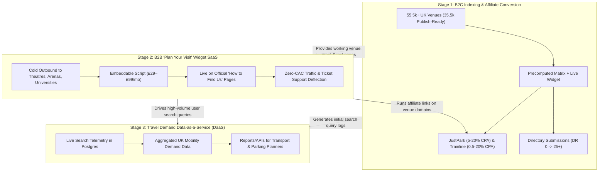

# EndMile Multi-Phase Execution Plan & Progress Tracker

*Last updated: 2026-08-21*

This document serves as the master operational execution plan and living progress log for EndMile's dual-track commercial strategy and long-term data asset. All AI agents and developers should update this tracker as tasks are completed, in progress, or unblocked.

---

## 1. Executive Summary & Growth Flywheel

EndMile operates a **3-Pillar Growth Engine** built on top of a zero-marginal-cost multimodal routing backend (self-hosted OSRM + MOTIS on a £50/mo VPS):

---

## 2. Multi-Stage Execution Plan

### Stage 1: B2C Indexing & Affiliate Conversion (Immediate Focus)
**Objective:** Establish search authority, index high-intent venue arrival guides, and generate immediate, passive affiliate cash flow.

| Initiative | Description & Strategy | Applicable Skills | Status |
|---|---|---|:---:|
| **1.1 Directory Foundation** | Execute Phase 1 directory submissions (Product Hunt, SaaSHub, AlternativeTo, Crunchbase, LinkedIn, DevHunt, BetaList) to build baseline Domain Rating (DR 20–30+) and pass dofollow link equity into programmatic venue pages. | [`directory-submissions`](file:///c:/Users/isaac/Videos/files%20too%20big%20for%20onedrive/github/endmile-1/.agents/skills/directory-submissions/SKILL.md), [`launch`](file:///c:/Users/isaac/Videos/files%20too%20big%20for%20onedrive/github/endmile-1/.agents/skills/launch/SKILL.md) | `[IN PROGRESS]` |
| **1.2 Expand Venue Publishing** | Scale from initial 200 published venues to 500 top-quality destinations (NHS Hospitals, Crown Courts, Arenas, Universities, Theatres) with 35,546 verified `publish_ready` candidates in reserve. Ensure each batch passes the composite publish gate. | [`endmile-b2c-matrix`](file:///c:/Users/isaac/Videos/files%20too%20big%20for%20onedrive/github/endmile-1/.agents/skills/endmile-b2c-matrix/SKILL.md), [`programmatic-seo`](file:///c:/Users/isaac/Videos/files%20too%20big%20for%20onedrive/github/endmile-1/.agents/skills/programmatic-seo/SKILL.md) | `[DONE]` |
| **1.3 Affiliate Conversion Optimization (CRO)** | **JustPark (IN PROGRESS):** Verified destination mapping (`data/affiliates/parking_destinations.json`), unmapped fallback, Awin 6188 wrapper with `clickref=venue_<id>`, start-station parking search on `driveToTrain` (`venue_<id>_stn_<crs>`). Full venue destination mapping and partner URL deep links remain in progress. **Trainline (IN PROGRESS):** Partnerize tracking parameter integration and station-pair deep linking remaining. | [`cro`](file:///c:/Users/isaac/Videos/files%20too%20big%20for%20onedrive/github/endmile-1/.agents/skills/cro/SKILL.md), [`copywriting`](file:///c:/Users/isaac/Videos/files%20too%20big%20for%20onedrive/github/endmile-1/.agents/skills/copywriting/SKILL.md) | `[IN PROGRESS]` |
| **1.4 Structured Data & AI Search (GEO)** | Validate JSON-LD markup (`Dataset`, `Place`, `TrainStation`, `FAQPage`, `BreadcrumbList`) and `/llms.txt` to maximize search rich snippets and citations in ChatGPT, Perplexity, and Claude. Clean markdown asterisks from schema strings. | [`schema`](file:///c:/Users/isaac/Videos/files%20too%20big%20for%20onedrive/github/endmile-1/.agents/skills/schema/SKILL.md), [`ai-seo`](file:///c:/Users/isaac/Videos/files%20too%20big%20for%20onedrive/github/endmile-1/.agents/skills/ai-seo/SKILL.md) | `[DONE]` |
| **1.5 Analytics & Telemetry Tracking** | Verify GA4 key events (`live_search_complete`, `affiliate_click`, `app_cta_click`) and track search performance via GSC and `scripts/analytics/guide-performance.mjs`. | [`endmile-guide-performance`](file:///c:/Users/isaac/Videos/files%20too%20big%20for%20onedrive/github/endmile-1/.agents/skills/endmile-guide-performance/SKILL.md), [`analytics`](file:///c:/Users/isaac/Videos/files%20too%20big%20for%20onedrive/github/endmile-1/.agents/skills/analytics/SKILL.md) | `[DONE]` |
| **1.6 UK Rail Fare Pipeline** | Multi-tier fare resolution across all 55,531 UK venues (Trainline scraping + 170k TfL zonal fares + MOTIS parallel breakdown + DfT regulated mileage tariff). 246,956 train legs 100% priced with integer pence and zero OJP API fees. | [`endmile-b2c-matrix`](file:///c:/Users/isaac/Videos/files%20too%20big%20for%20onedrive/github/endmile-1/.agents/skills/endmile-b2c-matrix/SKILL.md) | `[DONE]` |
| **1.7 Full B2C Content & Publish Gate Pipeline** | Deterministic content generation across all 55,531 venues (149s) with rich FAQ overhaul (2–3 regional city comparisons, accessibility gating, high-capacity car park details, exact return P&R bus fares). Published readiness audit: 35,546 `publish_ready`, 18,425 `enrich_first`, 1,388 `matrix_retry`, 172 `do_not_publish`. 500 top venues published generating 608 static pages in ~34s. | [`endmile-b2c-matrix`](file:///c:/Users/isaac/Videos/files%20too%20big%20for%20onedrive/github/endmile-1/.agents/skills/endmile-b2c-matrix/SKILL.md) | `[DONE]` |
| **1.8 Live Search Error Resiliency & Geocoding Edge Cases** | Added timezone offset ISO string acceptance in Fastify journey search schemas, non-fatal 400/404 handling in Google Places client to avoid tripping the circuit breaker on invalid place IDs, and defensive UI error handling & spinner recovery in `LiveWidget.astro`. | [`endmile-guide-performance`](file:///c:/Users/isaac/Videos/files%20too%20big%20for%20onedrive/github/endmile-1/.agents/skills/endmile-guide-performance/SKILL.md), [`cro`](file:///c:/Users/isaac/Videos/files%20too%20big%20for%20onedrive/github/endmile-1/.agents/skills/cro/SKILL.md) | `[DONE]` |

---

### Stage 2: B2B "Plan Your Visit" Widget Distribution (Active Track)
**Objective:** Convert the interactive venue planner into a recurring B2B SaaS revenue stream (£19–£49/mo per venue) by selling to UK theatres, museums, attractions, and universities.

| Initiative | Description & Strategy | Applicable Skills | Status |
|---|---|---|:---:|
| **2.1 Standalone Embed Packaging** | Finalized lightweight, responsive 1-line script embed (`packages/b2c_site/public/widget.js`) and marketing showcase (`packages/landing/src/pages/venue-widget.astro`) with mobile layout containment and zero layout shift. | [`free-tools`](file:///c:/Users/isaac/Videos/files%20too%20big%20for%20onedrive/github/endmile-1/.agents/skills/free-tools/SKILL.md), [`onboarding`](file:///c:/Users/isaac/Videos/files%20too%20big%20for%20onedrive/github/endmile-1/.agents/skills/onboarding/SKILL.md) | `[DONE]` |
| **2.2 Cold Outreach Campaign & Prospect Pipeline** | **Competitor Demarcation:** Bypassed 5-figure enterprise tenders (leaving TfGM and arenas to YST). Focused exclusively on the unserved 99% mid-market. **Discovery Engine:** Mined 111k OSM dataset, extracting **4,992 qualified unserved UK venues** with official websites (954 theatres, 2,418 museums, 1,197 attractions, 423 universities) into `data/venues/unserved_prospects.csv`. **Sales Playbook:** Authored `docs/product/venue-widget-outbound-playbook.md` with modular copy by archetype, 3-touch follow-ups, and objection handling. **Active Execution:** Founder is actively working through `unserved_prospects.csv` in Excel, locating named decision-makers (Head of Visitor Experience / Operations Director) via staff directories and LinkedIn, and sending personalized sniper emails (10–15/day). | [`cold-email`](file:///c:/Users/isaac/Videos/files%20too%20big%20for%20onedrive/github/endmile-1/.agents/skills/cold-email/SKILL.md), [`sales-enablement`](file:///c:/Users/isaac/Videos/files%20too%20big%20for%20onedrive/github/endmile-1/.agents/skills/sales-enablement/SKILL.md) | `[IN PROGRESS]` |
| **2.3 Tiered Pricing & Self-Serve Portal** | Implemented 4 tiers: Free Community (£0/mo, 50 searches with "Powered by EndMile" backlink), Standard (£19/mo, 150 searches), Growth (£49/mo, 750 searches), and Scale (£119/mo, 3k searches) live on `/venue-widget`. | [`pricing`](file:///c:/Users/isaac/Videos/files%20too%20big%20for%20onedrive/github/endmile-1/.agents/skills/pricing/SKILL.md), [`cro`](file:///c:/Users/isaac/Videos/files%20too%20big%20for%20onedrive/github/endmile-1/.agents/skills/cro/SKILL.md) | `[DONE]` |
| **2.4 Co-Marketing & Platform Partnerships** | Explore distribution partnerships with event ticketing platforms (Skiddle, Eventbrite, DICE) and parking operators (JustPark) to offer the widget to their venue networks. | [`co-marketing`](file:///c:/Users/isaac/Videos/files%20too%20big%20for%20onedrive/github/endmile-1/.agents/skills/co-marketing/SKILL.md), [`referrals`](file:///c:/Users/isaac/Videos/files%20too%20big%20for%20onedrive/github/endmile-1/.agents/skills/referrals/SKILL.md) | `[PLANNED]` |

---

### Stage 3: DaaS Monetization & Scale (Post-Traffic Traction)
**Objective:** Monetize retained search demand telemetry as an enterprise data product and activate premium ad networks once traffic reaches scale.

| Initiative | Description & Strategy | Applicable Skills | Status |
|---|---|---|:---:|
| **3.1 Intent Telemetry Pipeline** | Monitor and verify high-fidelity storage of anonymized search queries in Postgres (origin centroid, destination venue ID, travel mode selection, time of search, client surface). | [`analytics`](file:///c:/Users/isaac/Videos/files%20too%20big%20for%20onedrive/github/endmile-1/.agents/skills/analytics/SKILL.md), [`endmile-guide-performance`](file:///c:/Users/isaac/Videos/files%20too%20big%20for%20onedrive/github/endmile-1/.agents/skills/endmile-guide-performance/SKILL.md) | `[IN PROGRESS]` |
| **3.2 Data Packaging & Intent Reports** | Package aggregated search query trends into quarterly "UK Regional Travel & Parking Intent" market reports for municipal transport authorities, regional bus/train operators, and commercial parking networks. | [`product-marketing`](file:///c:/Users/isaac/Videos/files%20too%20big%20for%20onedrive/github/endmile-1/.agents/skills/product-marketing/SKILL.md), [`content-strategy`](file:///c:/Users/isaac/Videos/files%20too%20big%20for%20onedrive/github/endmile-1/.agents/skills/content-strategy/SKILL.md) | `[PLANNED]` |
| **3.3 Premium Display Ad Monetization** | Apply for premium ad networks (Setupad, MonetizeMore, Mediavine Journey at £12–£16 RPM) once `guide.endmilerouting.co.uk` exceeds 25,000–50,000 monthly pageviews. | [`cro`](file:///c:/Videos/files%20too%20big%20for%20onedrive/github/endmile-1/.agents/skills/cro/SKILL.md) | `[PLANNED]` |

---

## 3. Stage Gates & Prerequisites: "What Needs to Be Done Before We Move Forward"

To prevent premature scaling or wasted effort, each stage has strict operational prerequisites:

### Gate 1 $\to$ Gate 2 (Before Launching B2B Venue Outbound):
- [x] Live widget streaming API responds reliably (< 2s) with OSRM and MOTIS routing on the VPS.
- [x] Leaflet map correctly decodes sublegs (walk, bus, train, drive) and displays operator-colored train segments.
- [x] Directory foundations established (Crunchbase live, Product Hunt scheduled for Aug 18, SaaSHub/AlternativeTo submitted).
- [x] Full B2C dataset priced (55,531 venues, 246,956 rail legs) and 500 top-quality venue guides generated.
- [ ] **Affiliate Verification**: JustPark (Awin 6188) and Trainline (Partnerize) deep-linking and full venue destination mappings remain partially complete and in progress before Gate 2.
- [ ] **Venue Traffic Validation**: Reach at least 100+ monthly pageviews or documented search intent on top candidate venue pages before cold pitching.
- [ ] Standalone `<script>` embed tested on an external test HTML page.
- [ ] 1-page data-backed pitch sheet drafted for venue managers (using real search volume as the hook: *"X visitors searched travel to your venue on EndMile"*).

### Gate 2 $\to$ Gate 3 (Before Commercializing DaaS & Display Ads):
- [ ] At least 5–10 active venue widget embeds live on third-party domains or 50,000+ monthly B2C pageviews.
- [ ] Postgres query log retains > 10,000 anonymized origin-destination search pairs.
- [ ] Verified Google Consent Mode v2 & certified CMP integration complete before activating commercial ad scripts.

---

## 4. Current Detailed Task Log & Active Constraints

### Key Operational & Data Constraints:
1. **Partner Deep-Links (JustPark & Trainline) Partial Status**: While basic city fallbacks and Awin wrappers exist, granular venue destination mappings in `data/affiliates/parking_destinations.json` and Trainline station-pair booking URLs are still partially in progress.
2. **OpenStreetMap Data Coverage Gaps (`enrich_first`)**: In the publish readiness audit, **18,425 venues** (33.2%) are held in `enrich_first` due to missing OSM tags (`wheelchair`, `opening_hours`, `fee`, `entrance` coordinates), which prevents them from meeting the minimum distinct fact threshold without external enrichment.
3. **London Venue Unlock**: London destinations are eligible for `scripts/batch-router/generate-venue-matrix.mjs` after the 2026-08-21 TfL Park & Tube validation. The server route pattern is drive to verified outer London / TfL station car parks, transfer onto Tube/Elizabeth line/DLR/Overground where appropriate, use positive TfL Journey Planner fare data without static TfL fare fabrication, and suppress TfL P&R options that lack positive fare data.
4. **TfL API Rate-Limit Guardrail**: The London unlock does not remove TfL operational limits. TfL's standard subscription product is capped at 500 requests/minute, and London venue searches can fan out across National Rail, TfL last-mile, Park & Tube, city parking, and direct drive. Before any large London-inclusive matrix run, add a server-side global TfL request limiter below the cap, recommended at roughly 420-450 requests/minute with 429 `Retry-After` handling, plus a TfL queue/pressure endpoint for the CLI to poll. Until then, use London smoke batches only with `--concurrency 1 --origin-stagger-ms 1000 --api-timeout-ms 90000` or gentler.

### Active & Immediate Tasks (Stage 1)
- [x] **Directory Foundation Submissions**: Crunchbase live, SaaSHub submitted, AlternativeTo submitted, Product Hunt scheduled (Aug 18, 2026), paid/AI-only directories skipped.
- [x] **Full 55k B2C Content Generation**: Ran force generation across all 55,531 venue content JSONs in 149s with rich FAQ overhaul (2–3 regional routes, accessibility gating, exact P&R bus fares, parking capacities).
- [x] **Dataset Publish Readiness Audit**: Audited all 55,531 venues (35,546 `publish_ready`, 18,424 `enrich_first`, 1,388 `matrix_retry`, 172 `do_not_publish`).
- [x] **Batch Publish Scale to 500 Venues**: Ranked 35k candidates and expanded `data/b2c/published_venues.txt` to the top 500 highest-quality UK destinations (NHS hospitals, Crown Courts, arenas, universities, theatres, 99.8% 3-column coverage). Verified static build compiles 608 pages in ~34s and deployed live to `guide.endmilerouting.co.uk`.
- [x] **Publishing & Scaling Automation**: Created [`docs/b2c-pivot/publishing-guide.md`](publishing-guide.md) and [`scripts/batch-router/stage-published-venues.mjs`](file:///c:/Users/isaac/Videos/files%20too%20big%20for%20onedrive/github/endmile-1/scripts/batch-router/stage-published-venues.mjs) to automate allowlist updates, candidate ranking, and clean Git staging.
- [ ] **SEO Recovery & Editorial Reintegration Protocol (SpamBrain/Site Reputation Abuse Fixes)**:
  - **Legal Unification**: Remove explicit exclusion/disowning statements on root landing (`packages/landing/src/pages/terms.astro`, `cookies.astro`, `privacy.astro`) that state `guide.endmilerouting.co.uk` is not covered. Replace with unified corporate umbrella language + supplementary guide fare accuracy notice.
  - **Bidirectional Header Navigation**: Add prominent "Travel Guides" or "Venue Guides" link in root landing main navigation (`packages/landing/src/layouts/Base.astro`) linking to `guide.endmilerouting.co.uk` to eliminate the isolated subdomain heuristic.
  - **AdSense Removal on SaaS Landing**: Remove legacy Google AdSense script and meta tag from `packages/landing/src/layouts/Base.astro` (SaaS marketing should not carry ad publisher tags).
  - **Cloudflare Bot & AI Crawler Adjustment**: In Cloudflare Bot Management, toggle `ai_search: enabled` and `ai_user: enabled` (currently disabled) to allow ChatGPT-Search and PerplexityBot to index/cite venue arrival guides.
  - **GSC Sitemap Verification & Indexing Requests**: Verify `https://guide.endmilerouting.co.uk/sitemap.xml` in GSC and execute URL inspection on top 10 priority venues (Villa Park, Royal Armouries, Anfield, etc.) to stimulate re-crawl.
- [ ] **Trainline & JustPark Affiliate Deep Linking**: Complete granular venue destination mappings and Partnerize / Awin deep links across static matrix tables and dynamic rail route cards.
- [ ] **Affiliate Destination Expansion**: Add verified JustPark destination URLs to `data/affiliates/parking_destinations.json` for the new venue batch.
- [ ] **TfL Park & Tube London Unlock Gate**: Implemented and validated London-specific Park & Tube routing before London destinations enter the matrix CLI. Scope covered: verified outer TfL station car parks, positive live TfL Journey Planner fares, Tube/Elizabeth line/DLR/Overground last-mile handling, and smoke tests for central and outer London venues without timeout-heavy retries.
- [ ] **TfL Batch Rate-Limit Guard**: Add global server-side TfL request throttling, 429 backoff, and a CLI-readable TfL pressure endpoint before running broad London-inclusive matrix batches.

### Upcoming Next Actions (Stage 2)
- [x] Add a dedicated root-domain venue-widget product page using the controlled live iframe and secure responsive height messaging.
- [ ] Build `<script>` tag bundle in `@endmile/server` / `packages/b2c_site` for drop-in iframe/widget embedding.
- [ ] Validate search traffic volume (100+ visits per venue) to identify top target venues for B2B outreach.
- [ ] Create data-backed cold email outreach template targeting theatre and venue operations managers using [`cold-email`](file:///c:/Users/isaac/Videos/files%20too%20big%20for%20onedrive/github/endmile-1/.agents/skills/cold-email/SKILL.md).
- [ ] Create 1-page B2B feature summary ("Plan Your Visit Widget") using [`sales-enablement`](file:///c:/Users/isaac/Videos/files%20too%20big%20for%20onedrive/github/endmile-1/.agents/skills/sales-enablement/SKILL.md).

---

## 5. Key Metrics & Target Milestones

| Target Date | Milestone / Metric Target | Current Status |
|---|---|---|
| **Month 1** | **500 venues live** (608 static pages); directory foundation launched; 100% rail fares priced; JustPark affiliate tracking active & verified. | **DONE / LIVE** |
| **Month 2** | 1,000 to 2,500 venues live; DR 20+; 5 B2B pilot venue widgets deployed; £150/mo affiliate revenue. | Planned |
| **Month 3** | 5,000 venues live; 25 B2B venue subscribers (£750+ MRR); 50k monthly pageviews. | Planned |
| **Month 6** | 10,000 to 35,500 venues live; 100+ B2B subscribers; Premium ad network live (£2,000+/mo net profit). | Planned |

---

## 6. Honest Competitor Positioning Matrix & Guardrails

To prevent misleading claims, all marketing copy, directory submissions, and comparison pages must follow these factual competitor boundaries:

| Competitor | Their True Strengths | Their Limitations for UK Venues | EndMile's Honest Moat |
|---|---|---|---|
| **Rome2rio** | Global multimodal coverage across 160+ countries (flights, ferries, trains, long-distance buses). High domain authority (DR 85+). | **Approximations only.** Outputs broad estimated fare bands (e.g. "$20–$60"), zero local UK parking tariffs, no station-to-venue walking maps, and no B2B embeddable widget. | Hyper-local UK precision: exact CRS rail fares, verified city car park tariffs, Park & Ride timings, and interactive last-mile walking polylines. |
| **Moovit** | World-class urban transit navigation, live bus countdowns, line alerts, and global city transit data. | **Commuter transit focus.** Built for intracity public transit commuters. Does not calculate driving fuel vs parking vs train cost trade-offs for UK event/venue visits. | First-class car integration (Drive to Station, Drive to City Parking, Park & Ride) calculating true Total Cost of Ownership including parking fees. |
| **Citymapper** | Unrivaled urban navigation in London, Birmingham, and Manchester (live platform alerts, tube exit guidance). | **Strict urban boundary.** Does not cover regional/intercity travel across the whole UK (e.g. Ripon to Newcastle or rural UK destinations). No venue parking guides. | Complete UK mainland coverage across 38k+ destinations (arenas, hospitals, courts, universities, stadiums, theatres) with origin-to-door comparison. |
| **Google Maps** | Ubiquitous navigation standard with turn-by-turn driving and transit directions. | **Zero cost visibility.** Does not show destination parking charges, rail ticket prices, or door-to-door travel costs. No embeddable customizable widget for venue websites. | Pre-travel decision engine: reveals total financial cost (fares, fuel, parking, congestion) before the user sets off and offers drop-in venue widgets. |
| **Trainline** | Dominant UK rail ticket retail platform with split-ticketing algorithms. | **Station-to-station only.** Ignores how travellers get to the origin station, station parking fees, and last-mile transit/walking to the final venue door. | Multimodal door-to-door partner: offloads rail ticket sales to Trainline via affiliate links while providing the full journey context Trainline lacks. |

---

## 7. The 4 Core Directory Positioning Variants (Ready-to-Use Copy for EndMile Guide)

Per [`directory-submissions`](file:///c:/Users/isaac/Videos/files%20too%20big%20for%20onedrive/github/endmile-1/.agents/skills/directory-submissions/SKILL.md), unique copy variants are tailored for **EndMile Guide** (`guide.endmilerouting.co.uk`) across each directory tier:

### Variant A: SaaS & Travel-Tech Directories (SaaSHub, AlternativeTo, SourceForge)
- **Product Name:** EndMile Guide
- **Target URL:** `https://guide.endmilerouting.co.uk`
- **Tagline (under 10 words):** UK destination arrival guides and multimodal venue travel planner.
- **Short Description (60 chars):** Compare UK venue travel costs, parking tariffs & rail fares.
- **Long Description (150 words):**  
  EndMile Guide (guide.endmilerouting.co.uk) is a UK destination travel planner covering more than 38,000 high-friction destinations, including major NHS hospitals, Crown Courts, arenas, stadiums, universities, and theatres.  
  Unlike standard mapping apps that only display driving duration or public transit timetables in isolation, EndMile Guide compares the full door-to-door journey: calculating fuel costs, verified city centre car park tariffs, Park & Ride fees, National Rail ticket fares, and station-to-venue walking times.  
  Every venue guide provides a precomputed regional journey matrix from nearby UK cities alongside an interactive live postcode planner. Visitors can compare driving to parking vs rail transit, inspect last-mile walking paths, and pre-book parking or train tickets before setting off.
- **Category Tags:** Travel Tech, Route Planner, Maps & Navigation, UK Travel, Parking, Public Transportation.
- **Founder Story:** "We created EndMile Guide because attending a hospital appointment, court date, or arena concert in an unfamiliar UK city shouldn't require checking three separate websites to find parking tariffs, station walk times, and train costs."

### Variant B: Startup & Community Launch (Product Hunt, BetaList, Fazier, DevHunt)
- **Product Name:** EndMile Guide
- **Target URL:** `https://guide.endmilerouting.co.uk`
- **Tagline (under 10 words):** Multimodal UK venue arrival guides with live parking tariffs.
- **Short Description (60 chars):** Door-to-door UK venue travel guides and live route planner.
- **Long Description (150 words):**  
  Travelling to a major UK venue often involves guesswork around parking tariffs, station distances, and whether taking the train is actually cheaper than driving.  
  EndMile Guide solves this with dedicated arrival guides for over 38,000 UK destinations, from Leeds First Direct Arena to regional Crown Courts and NHS hospitals. It calculates the real door-to-door cost of travel by combining self-hosted OSRM driving routes, MOTIS transit calculations, live National Rail fares, and verified local parking fees.  
  Visitors get instant regional comparison tables, last-mile walking maps, and a live streaming route planner to compare driving to a car park, suburban Park & Ride, or rail travel from any UK postcode.
- **Category Tags:** Travel, Mobility, Web Apps, Route Planner, UK Travel, Productivity.
- **PH First Comment:** "Hello Product Hunt. I built EndMile Guide to fix a simple frustration: whenever people travel to an unfamiliar UK venue, they have to jump between maps, Trainline, and council parking pages to work out the cheapest and easiest route. EndMile Guide puts door-to-door driving, parking fees, train fares, and last-mile walking onto one screen. Would appreciate your feedback on the live venue search and regional matrices."

### Variant C: Venue & Event Tech Embeds (B2B SaaS / G2, Capterra, Event Directories)
- **Product Name:** EndMile Venue Guide Widget
- **Target URL:** `https://endmilerouting.co.uk` (with Guide preview at `https://guide.endmilerouting.co.uk`)
- **Tagline (under 10 words):** Live "Plan Your Visit" travel widget for UK venue websites.
- **Short Description (60 chars):** Interactive travel planner widget for UK venue and event sites.
- **Long Description (150 words):**  
  EndMile Venue Guide Widget is an embeddable travel intelligence tool for UK theatres, arenas, stadiums, event centres, and universities. It replaces static "How to Find Us" text pages with a live, interactive door-to-door journey planner.  
  Visitors enter their origin postcode to view clear multimodal route choices from anywhere in the UK, complete with verified local parking tariffs, Park & Ride connections, rail options, and station-to-venue walking directions.  
  By providing clear travel and parking logistics directly on the venue website, the widget eliminates attendee parking confusion, prevents event arrival delays, and substantially cuts customer support inquiries regarding directions and parking.
- **Category Tags:** Event Management Software, Visitor Management, Website Widgets, Travel Management.
- **Primary Value Metric:** Cuts travel-related customer support tickets and visitor parking inquiries for venue operations teams.

### Variant D: AI Registries & Travel Data Directories (TAAFT, Futurepedia, Toolify, Glama)
- **Product Name:** EndMile Guide
- **Target URL:** `https://guide.endmilerouting.co.uk`
- **Tagline (under 10 words):** Structured UK destination arrival intelligence and routing dataset.
- **Short Description (60 chars):** Semantic UK venue travel guides and multimodal routing engine.
- **Long Description (150 words):**  
  EndMile Guide is a structured travel intelligence engine and programmatic arrival guide dataset covering 38,000+ UK destinations. Powered by self-hosted Open Source Routing Machine (OSRM) and Multi-Objective Traffic Information System (MOTIS) instances, it models complex door-to-door journeys across driving, rail, parking, and walking modes.  
  Every venue guide incorporates extensive Schema.org JSON-LD structured data (Dataset, Place, TrainStation, FAQPage), machine-readable `/llms.txt` endpoints, and verified UK parking tariffs. EndMile Guide provides an authoritative reference layer for search crawlers and AI answer engines resolving UK transport queries.
- **Category Tags:** AI Tools, Datasets, Travel Intelligence, Transportation, Developer Tools, APIs.

---

## 8. Directory Submission Tracker & Status

| Platform | Tier | Target URL | Target Surface | Status | Verified Dofollow? | Notes / Moderator Feedback |
|---|:---:|---|---|:---:|:---:|---|
| **Crunchbase** | Tier 8 | `https://endmilerouting.co.uk` | Company Entity | `[LIVE]` | Verified | Live organization profile at [`organization/endmile-routing`](https://www.crunchbase.com/organization/endmile-routing). Knowledge Graph entity established. |
| **SaaSHub** | Tier 2 | `https://guide.endmilerouting.co.uk` | B2C Guide & Travel Tool | `[SUBMITTED]` | In Review | Submitted via [`manage/endmile/questions`](https://www.saashub.com/manage/endmile/questions). Directs traffic to venue guides & affiliate links. |
| **AlternativeTo** | Tier 2 | `https://guide.endmilerouting.co.uk` | B2C Guide & Travel Tool | `[SUBMITTED]` | In Review | Live listing draft at [`software/endmile/about`](https://alternativeto.net/software/endmile/about/). Positioned vs Rome2rio, Citymapper, Google Maps. |
| **Product Hunt** | Tier 1 | `https://guide.endmilerouting.co.uk` | B2C Guide & Live Widget | `[SCHEDULED]` | Scheduled | Confirmed scheduled to launch on **Tuesday, August 18th, 2026 at 12:01 AM PDT (08:01 AM BST)**. Public prelaunch page at [`products/endmile-guide`](https://www.producthunt.com/products/endmile-guide) and [`prelaunch`](https://www.producthunt.com/products/endmile-guide/endmile-guide/prelaunch). |
| **LinkedIn Page** | Tier 8 | `https://endmilerouting.co.uk` | Company Entity | `[IN PROGRESS]` | N/A | Company page created (9 followers); overview update ready. |
| **G2** | Tier 2 | `https://endmilerouting.co.uk` | B2B Venue Widget SaaS | `[PLANNED]` | Pending | Free listing setup; use Variant C; plan 10-in-30 review outreach. |
| **Capterra** | Tier 2 | `https://endmilerouting.co.uk` | B2B Venue Widget SaaS | `[PLANNED]` | Pending | Event management / visitor management category; use Variant C. |
| **BetaList** | Tier 1 | `https://guide.endmilerouting.co.uk` | B2C Guide & Live Widget | `[SKIPPED]` | N/A | Requires paid fast-track ($99–$299); skipped per Rule 1 free-first policy. |
| **Futurepedia** | Tier 3 | `https://guide.endmilerouting.co.uk` | AI & Travel Search | `[SKIPPED]` | N/A | Requires paid listing ($147+); skipped per Rule 1 free-first policy. |
| **TAAFT** | Tier 3 | `https://guide.endmilerouting.co.uk` | AI & Travel Search | `[SKIPPED]` | N/A | Excluded to preserve accurate deterministic routing identity (non-generative AI). |
