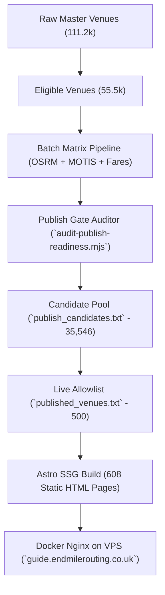

# EndMile B2C Venue Publishing & Scaling Guide

*Last updated: 2026-08-18*

This guide explains how venue arrival guides are published to **EndMile Guide** (`guide.endmilerouting.co.uk`), how to expand the published allowlist, and the best practices for maintaining repository health and automated deployments.

---

## 1. High-Level Architecture & Concepts

EndMile's B2C architecture consists of three layers:



### Core Files
| File / Directory | Purpose | Git Status |
|---|---|:---:|
| `data/b2c/published_venues.txt` | **Authoritative live allowlist.** Lists the exact venue IDs to compile into static HTML during Astro build. | **Tracked** |
| `data/b2c/publish_candidates.txt` | **Ranked candidate registry.** All 35,546 UK venues that have passed the composite quality & routing gate. | **Tracked** |
| `data/b2c/publish_readiness_report.json` | Comprehensive breakdown of candidate quality scores, transit column metrics, and addresses. | **Tracked** |
| `data/b2c/venues/<id>.json` | Precomputed multimodal routing matrix per venue (driving polylines omitted; transit & P&R preserved). | **Tracked / Batch syncable** |
| `data/b2c/content/<id>.json` | Deterministic FAQs, arrival tips, and contextual copy per venue. | **Tracked / Batch syncable** |

---

## 2. Dataset Management & Batch Committing

Locally and on server nodes, the batch router maintains matrices and content for all **55,531 venues** (~111,000 JSON files total).

### Sizing & Driving Polyline Pruning
- Driving polylines (`directDrive` and P&R driving segments) are omitted from storage since the static interactive map renders last-mile transit/walk connections. This reduces total venue matrix dataset size from **10.2 GB down to ~3.0 GB** (~50–70 KB per venue).
- Content files total **~357 MB** across all 55.5k venues (~6.4 KB per file).

### How to Commit Dataset to Git
There are two supported workflows for tracking venue data:

1. **Option A: Allowlist Staging (Lean Repo)**
   - Only stages the active IDs in `data/b2c/published_venues.txt`.
   - Command: `node scripts/batch-router/stage-published-venues.mjs`
   - Keeps repository size small (< 100 MB).

2. **Option B: Full Dataset Batch Commit (Remote Scaling)**
   - Commits all 55k content and matrix JSONs in safe, optimized chunks:
     - **Content files:** Batches of **10,000 files** (~60 MB/commit).
     - **Venue matrix files:** Batches of **5,000 files** (~270 MB/commit).
   - Command: `node scripts/batch-router/batch-commit-dataset.mjs`
   - **Why these batch sizes?** Batches of 5k–10k files prevent command-line length overflows on Windows and stay well below GitHub's 2 GB single-push HTTP unpack limits, enabling remote allowlist expansion from GitHub without local git staging.

---

## 3. Step-by-Step: How to Expand the Published Venue List

When you want to increase the published venue count (e.g. from 500 $\to$ 1,000 $\to$ 2,500 $\to$ 10,000):

### Step 1: Create a Feature Branch
Always work on a clean feature branch off `main`:
```bash
git checkout main
git pull origin main
git checkout -b feat/b2c-expand-venues-1000
```

### Step 2: Choose Venues from Candidate Pool
All 35,546 venues in `data/b2c/publish_candidates.txt` are pre-validated and ready to publish.

To take the top $N$ quality-ranked candidates:
```bash
# Example: Take top 1,000 candidates and write to published_venues.txt
node -e "
const fs = require('fs');
const lines = fs.readFileSync('data/b2c/publish_candidates.txt', 'utf8')
  .split('\n')
  .map(l => l.trim().split(/\s+/)[0])
  .filter(id => id && !id.startsWith('#'));

const top1000 = lines.slice(0, 1000);
const header = '# Top 1000 publish-ready B2C venues\n';
fs.writeFileSync('data/b2c/published_venues.txt', header + top1000.join('\n') + '\n');
console.log('Updated published_venues.txt to ' + top1000.length + ' venues.');
"
```

### Step 3: Run the Staging Tool
Run the staging script to automatically stage code, configs, and the exact JSON files for the published allowlist:
```bash
node scripts/batch-router/stage-published-venues.mjs
```
*This stages all source code and exactly the JSON files required for the allowlist in batch chunks.*

### Step 4: Test Local Static Build
Verify that Astro compiles all pages without errors:
```bash
pnpm --filter @endmile/b2c-site build
```
*Expected: Compiles cleanly into `dist/` (e.g. 1,000 venue guides + region/city hubs).*

### Step 5: Commit and Push
```bash
git commit -m "feat(b2c): expand published venues allowlist to 1,000 guides"
git push -u origin feat/b2c-expand-venues-1000
```

### Step 6: Create Pull Request & Merge
```bash
gh pr create --base main --head feat/b2c-expand-venues-1000 --title "feat(b2c): expand published venues to 1,000" --body "Expands published allowlist to 1,000 verified UK venue guides."
gh pr merge --merge
```

### Step 7: Monitor Deployment & Verify Live
Watch the GitHub Actions deployment:
```bash
gh run list --limit 3
gh run watch <run-id>
```

Once `Deploy via SSH` completes on the VPS, verify live production:
```bash
# Verify sitemap has the updated count
curl -s https://guide.endmilerouting.co.uk/sitemap.xml | grep -c "<loc>"

# Test a newly published venue guide
curl -s -o /dev/null -w "%{http_code}\n" https://guide.endmilerouting.co.uk/venues/first-direct-arena-110034448/
```

---

## 4. Quality Scoring & Publishing Thresholds

Candidates in `publish_candidates.txt` are ranked using this multi-factor quality model:

| Quality Signal | Weight | Requirement |
|---|:---:|---|
| **3-Column Transit Coverage** | High | Venue must have valid Driving, Train/Transit, and Park & Ride options from nearby origin cities. |
| **Address & Postcode Richness** | High | Complete street address, city, and verified UK postcode (e.g. `M3 4FP`). |
| **Official Website & Facts** | Medium | Official website URL and category-specific arrival facts (parking options, bag policies, step-free access). |
| **High Friction Categories** | Bonus | Priority given to Hospitals, Crown Courts, Major Theatres, Arenas, and Universities where pre-travel stress is highest. |

---

## 5. Summary of Useful Commands

| Task | Command |
|---|---|
| Audit dataset readiness | `npm run audit:publish-readiness` |
| Generate venue content | `node scripts/batch-router/generate-venue-content.mjs` |
| Stage published venue files | `node scripts/batch-router/stage-published-venues.mjs` |
| Build B2C site locally | `pnpm --filter @endmile/b2c-site build` |
| Run B2C tests | `pnpm --filter @endmile/b2c-site test` |
| Analyze guide telemetry | `node scripts/analytics/guide-performance.mjs --days 28` |
