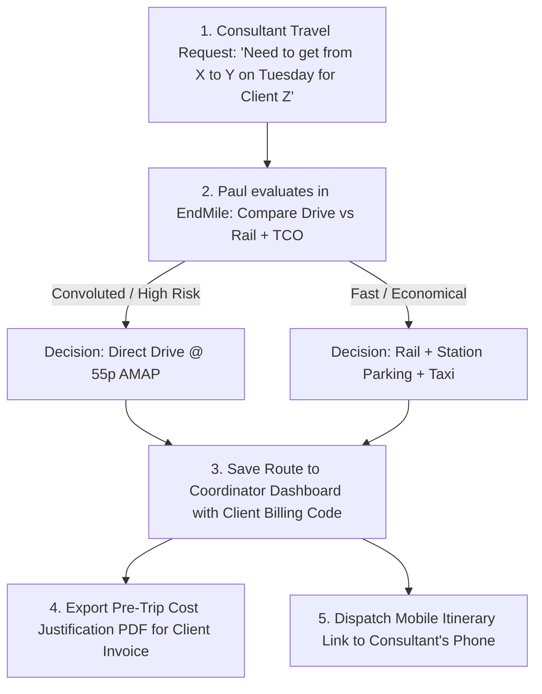
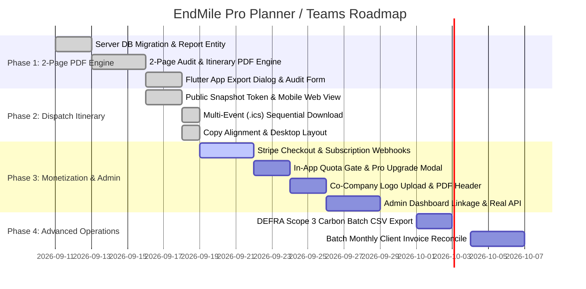

# B2B Pre-Trip Travel Cost Justification & Consultant Dispatch Specification

*Status: Approved Design / Master Product Specification*  
*Last updated: 2026-09-18*  
*Target Package: `packages/server/`, `packages/app/` & `packages/admin_portal/`*

---

## 1. Executive Summary & The Reality of the "Paul Hardy" Persona

### 1.1 Who Paul Hardy Really Is (The Pre-Trip Logistics Coordinator)
Paul Hardy (`logistics@dorsetsoftware.com`) is **not** an HR compliance auditor or a corporate payroll clerk checking retroactive expense receipts for mileage fraud. 

Paul is an **operational Logistics Coordinator / Travel Dispatcher** for an IT consultancy (Dorset Software Services Ltd, Poole):
1. **The Travel Intake**: A consultant (or project manager) notifies Paul: *"I have an assignment on Tuesday: I need to get from Poole HQ (or home) to Oxford Science Park for Client X."*
2. **The Decision Engine**: Paul opens EndMile to evaluate the options:
   - **If Rail is viable**: He selects train, identifies the origin station car park, maps the last-mile taxi transfer, and checks interchange risk.
   - **If Rail is convoluted or high-risk** (e.g., 3 train changes, 4+ hours, rail strikes, £150+ fare vs a 2-hour drive): Paul makes the executive dispatch call: *"Drive, here is your mileage allowance (55p/mi) and destination parking instructions."*
3. **The Save & Dashboard Management**: Paul saves and schedules the route in his coordinator dashboard under the client's project billing code (`CLI-OXF-2026`).
4. **The Client Invoice Justification**: Paul generates an immutable, 1-page **Pre-Trip Travel Cost Justification PDF** to attach to the client's monthly recharge invoice—preemptively proving to client Accounts Payable why the travel cost (£110 mileage or £75 rail+taxi) is legitimate and defensible.
5. **The Consultant Dispatch**: Paul sends the zero-login **Digital Mobile Itinerary Link** directly to the consultant via SMS/email so they have turn-by-turn platform, parking, and navigation instructions on travel day.

### 1.2 The Closed-Loop Dispatch Workflow


---

## 2. The "Why" (Strategic & Commercial Rationale)

### 2.1 The Value Reframe: Margin Protection vs Time Saving
- **Why Route Planning Tools Fail**: Pitching a tool that *"saves your logistics coordinator 15 minutes"* yields low willingness-to-pay (£5–£10/month), as administrative time-saving is rarely prioritized by CFOs.
- **The High-WTP Reality (Margin Protection)**: In UK professional services and IT consulting, firms lose **1% to 5% of their gross earnings (EBTA) to "margin leakage"**—travel expenses incurred by consultants that are subsequently disputed, rejected, or written off by client Accounts Payable (AP) departments.
- **The Disputed Recharge Scenario**:
  - Effective April 2026, HMRC Approved Mileage Allowance Payment (AMAP) increased from 45p to **55p/mile** (for the first 10,000 miles).
  - A 200-mile round trip now costs **£110 in mileage alone**.
  - Client AP auditors, doing retrospective checks on Trainline, see a £60 train ticket and reject the £110 mileage claim.
  - The client auditor fails to account for the £15 station parking fee, the £25 destination taxi, and the 2 hours of extra consultant transit time.
  - The consultancy's project manager is forced to write off the £110 from project profit.
- **The ROI Formula**: A single prevented client invoice dispute (£110 + VAT) pays for **5+ months of EndMile Pro (£19/mo)**. Attaching EndMile's Pre-Trip TCO PDF to the invoice pre-emptively neutralizes client AP audit challenges.

### 2.2 Taxation, Recharges & IR35 Compliance
- **Recharge vs Disbursement**: In UK consulting, travel is a *recharge* (consumed in delivering the service), NOT a disbursement. Therefore, **standard 20% VAT must be added to travel recharges on client invoices**, inflating the client's bill and magnifying cost scrutiny.
- **IR35 Safeguards**: Using a client's internal expense tool or claiming travel on client systems risks triggering disguised employment markers under UK IR35 legislation. Consultancies must submit independent, professional billing evidence. EndMile provides this independent audit artifact.

### 2.3 ESG Mandates: PPN 06/21 & Scope 3 Category 6
- Under UK Procurement Policy Note 06/21 (PPN 06/21) and the NHS Net Zero Supplier Roadmap, mid-tier consultancies bidding on central government or NHS tenders must submit Carbon Reduction Plans (CRPs).
- These mandates require granular reporting of **Scope 3 Category 6 (Business Travel)**.
- EndMile models carbon using official UK Government DEFRA/DESNZ 2026 GHG conversion factors, turning compliance into an automatic byproduct of route dispatch.

### 2.4 Departmental Credit Card "Shadow IT" Threshold (<£50/month)
- Corporate procurement and InfoSec reviews are triggered for software contracts exceeding £500/year.
- However, Operations Managers and Logistics Leads carry departmental corporate credit cards (P-Cards) with discretionary spending limits. Software priced under **£50/month** can be purchased immediately without procurement or CFO approval.
- Pricing at **£19/mo (Pro Planner)** and **£49/mo (Teams)** fits squarely inside this frictionless shadow-IT authorization band.

### 2.5 The Built-in Viral PLG Loop
Each trip planned generates two high-visibility assets:
1. **The Digital Itinerary Link**: Sent directly to travelling consultants, introducing EndMile to 50–100 consultants who carry brand awareness to future teams.
2. **The PDF Justification**: Sent to Project Managers, Finance Heads, and external Client AP teams, displaying *"Powered by EndMile Pre-Trip Intelligence"*.

---

## 3. The "What" (Product Feature Specification)

### 3.1 Monetization Tiers & Packaging (Post-Beta Target)

> [!NOTE]
> **Active Rollout Status (Open Unlimited Beta)**: During the current beta phase, the Pre-Trip PDF Generator is labeled **`BETA`** and offered with **unlimited, unrestricted exports** across both mobile and web clients. This enables unconstrained observation of real coordinator usage volume (via PostHog telemetry: `share_menu_opened`, `share_link_copied`, `share_summary_copied`, `share_calendar_downloaded`, `pdf_export_interest_clicked`, `pdf_report_exported`, and `shared_snapshot_viewed`) without user friction or premature paywalls. The tiered gating below will be activated after natural coordinator adoption is verified.

| Tier | Price | Target Persona | Features & Limits |
|---|---|---|---|
| **Free / Individual** | £0 | Solo travellers & ad-hoc searchers | • Unlimited multimodal route searches<br>• Up to 3 active saved journeys<br>• **3 lifetime PDF exports** (watermarked with *"Generated by EndMile"*)</br>• Default 55p AMAP mileage rate |
| **Pro Planner (Solo B2B)** | **£19 / mo**<br>(or £190 / yr) | Single coordinators, freelance PMs | • **1 Coordinator Seat**<br>• **Unlimited Saved Routes** & advance scheduling<br>• **Unlimited PDF Route & Expense Reports** (no watermark)<br>• Custom HMRC mileage rates (55p, 45p, 25p, EV tariffs)<br>• Client & Project Billing Code tagging<br>• 1-click shareable read-only itinerary link for mobile |
| **EndMile Teams** | **£49 / mo**<br>(or £490 / yr) | Regional consultancies (e.g. Dorset Software) | • **Up to 3 Coordinator Seats** (£15/mo per extra seat)<br>• **White-label PDF branding** (Company logo & *"Prepared by Dorset Software"*)</br>• Pre-trip Policy Rule Flags (e.g. *"Flag if driving > 3.5h"*)</br>• Aggregated DEFRA Scope 3 Category 6 carbon exports (CSV)<br>• Batch monthly export for Xero / Sage billing reconciliation |

### 3.2 In-App Paywalls & Quota Gating (Deferred to Post-Beta)
1. **PDF Export Quota Gate (Post-Beta)**:
   - Free users will have an allowance of 3 PDF exports.
   - On the 4th export attempt, display the upgrade modal:
     > **"Generate Unlimited Client Billing & Expense Reports"**  
     > *Attach professional, audit-defensible travel cost breakdowns to client invoices. Unlock unlimited exports, custom rates, and project billing codes.*  
     > **[Start 14-Day Free Trial - £19/mo]** • *[Maybe Later]*
2. **Saved Routes Limit Gate**:
   - Free users can save up to 3 active routes. On the 4th save attempt:
     > **"You've reached your free saved routes limit (3)."**  
     > *Upgrade to EndMile Pro to schedule and manage unlimited consultant deployments weeks in advance.*
3. **Custom Rate Preset Gate**:
   - Inside route details or settings: `Mileage Rate: [55p/mile (HMRC Default) ▼]`.
   - Clicking custom rates (e.g. 45p legacy, 25p excess, company car fuel rate) prompts the Pro upgrade modal.

### 3.3 The 1-Page PDF Structure ("Pre-Trip Travel Cost Justification")
The PDF is strictly formatted to fit on a single A4 page with high information density:
- **Header**:
  - Company Logo (Teams tier) or EndMile Logo.
  - Document Title: `PRE-TRIP TRAVEL COST JUSTIFICATION & EXPENSE AUDIT`.
  - Metadata: Client/Project Code (e.g. `CLI-OXF-2026`), Date Planned, Date of Travel, Traveller Name.
- **Section 1: Door-to-Door Multimodal Comparison Table**:
  - Compares Direct Drive vs Rail (+ Taxi) vs Park & Ride side-by-side.
  - Columns: `Mode`, `Travel Duration`, `Total Cost (£)`, `Carbon (kgCO2e)`, `Audit Recommendation`.
- **Section 2: Itemized Selected Option Breakdown**:
  - For Driving: Route distance, Mileage allowance (e.g. `108.4 mi @ 55p = £59.62`), destination car park name and daily business tariff, congestion/CAZ charges.
  - For Rail: Origin departure station, first-mile drive/taxi, station car parking tariff, train ticket fare & class, destination last-mile taxi/walk.
  - Total Rechargeable Cost.
- **Section 3: Policy & Audit Defensibility Justification**:
  - Dynamic explanatory sentence: *"Selected route (Rail) represents the lowest door-to-door TCO, mitigating driving fatigue on journeys exceeding 2.5 hours, and reducing Scope 3 emissions by 25.8 kgCO2e vs direct driving."*
- **Footer**:
  - Timestamp, DEFRA 2026 conversion factor citation, National Rail OJP verification hash, and verification QR code linking to `https://app.endmilerouting.co.uk/itinerary/ver_[token]`.

### 3.4 The Consultant Mobile Itinerary (`/itinerary/[shareToken]`)
A responsive, zero-login web page optimized for smartphone viewing:
- **Overview Card**: Destination name, required arrival time, travel date.
- **Interactive Stepper Timeline**:
  - Step 1: Depart Home/Office (SatNav address, estimated drive time).
  - Step 2: Station Parking (Exact car park name, postcode, walking time to platform).
  - Step 3: Train Connection (Operator, departure platform, calling points, interchange buffer).
  - Step 4: Arrival Station & Last Mile (Pre-calculated taxi estimate or walking route).
  - Step 5: Arrival at Client Site.
- **Utility CTAs**:
  - `[Add to Apple / Google Calendar]` (Downloads `.ics` file with built-in transfer buffers).
  - `[Open in Google Maps / Apple Maps]` (Launches navigation to next transfer point).
  - `[Live Disruption Alerts]` (Displays live National Rail status).

### 3.5 The Coordinator Dispatch Dashboard (`/dispatches`)
A high-efficiency desktop view tailored to Paul's daily operational flow:
- **Upcoming Dispatches Board**:
  - Table showing upcoming consultant trips: `Date`, `Traveller`, `Origin → Destination`, `Client / Project Code`, `Selected Mode`, `Total Cost (£)`, `Status (Planned / Dispatched / Completed)`.
- **Quick-Action Dispatch Drawer**:
  - `[Export Pre-Trip PDF Justification]` (Generates the 1-page A4 audit attachment for client billing).
  - `[Copy / SMS / Email Itinerary Link]` (Sends the zero-login mobile link to the consultant).
  - `[Duplicate / Return Leg]` (Instantly plans the reverse route for return travel).
- **Monthly Client Billing Summary**:
  - Aggregates travel costs by Client Code (e.g. `CLI-OXF-2026: £432.50 across 4 trips`) with CSV/Xero export for finance invoicing.

---

## 4. The "How" (Technical Architecture & Engineering Design)

### 4.1 Clean Architecture Alignment (Server Package)
Following the repository's strict Clean Architecture rules (`packages/server/`):

```
packages/server/src/
├── domain/
│   ├── entities/
│   │   └── journey-report.ts         # JourneyReport entity & status enums
│   └── repositories/
│       └── journey-report-repository.ts # IDomain interface for report storage
├── application/
│   └── use-cases/
│       ├── generate-journey-report-use-case.ts # Orchestrates data collation & PDF generation
│       └── get-journey-report-use-case.ts      # Authenticated fetch of report artifact
├── infrastructure/
│   ├── database/
│   │   ├── repositories/
│   │   │   └── pg-journey-report-repository.ts # Postgres implementation with RLS
│   │   └── migrations/
│   │       └── 00XX_create_journey_reports.sql
│   └── reporting/
│       ├── pdf-report-renderer.ts    # Headless HTML-to-PDF template engine
│       └── templates/
│           └── cost-justification.html # CSS Print-optimized HTML template
└── interface/
    └── routes/
        ├── journey-report-routes.ts  # POST /journeys/saved/:id/reports, GET /journey-reports/:id/download
        └── public-itinerary-routes.ts# GET /itineraries/public/:token (zero-login mobile view)
```

### 4.2 Database Schema (`journey_reports`)
```sql
CREATE TABLE journey_reports (
  id UUID PRIMARY KEY DEFAULT gen_random_uuid(),
  tenant_id UUID NOT NULL REFERENCES tenants(id),
  user_id UUID NOT NULL REFERENCES users(id),
  saved_journey_id UUID NOT NULL REFERENCES saved_journeys(id) ON DELETE CASCADE,
  report_type TEXT NOT NULL CHECK (report_type IN ('expense_evidence', 'journey_summary')),
  status TEXT NOT NULL DEFAULT 'ready' CHECK (status IN ('pending', 'ready', 'failed')),
  client_code TEXT,
  traveler_name TEXT,
  share_token TEXT UNIQUE NOT NULL DEFAULT encode(gen_random_bytes(16), 'hex'),
  report_data JSONB NOT NULL,
  pdf_storage_key TEXT,
  pdf_bytes BYTEA,
  created_at TIMESTAMPTZ NOT NULL DEFAULT now(),
  updated_at TIMESTAMPTZ NOT NULL DEFAULT now()
);

CREATE INDEX idx_journey_reports_tenant_user ON journey_reports(tenant_id, user_id);
CREATE INDEX idx_journey_reports_share_token ON journey_reports(share_token);

-- Enforce PostgreSQL Row-Level Security
ALTER TABLE journey_reports ENABLE ROW LEVEL SECURITY;

CREATE POLICY journey_reports_tenant_isolation ON journey_reports
  FOR ALL
  USING (tenant_id = current_setting('app.current_tenant_id', true)::uuid);
```

### 4.3 PDF Generation Engine Choice
- **Recommendation**: HTML Template rendered via `@sparticuz/chromium` + `puppeteer-core` or a lightweight native renderer (`pdfkit` / `@react-pdf/renderer`).
- **Why HTML/CSS Print**: Guarantees pixel-perfect layout matching the EndMile design system (`packages/b2c_site/` styling), easily handles dynamic tables and barcodes, and avoids hardcoded coordinate math.
- **Performance**: Generating a 1-page PDF takes ~250–400ms in headless Chromium and produces a clean ~45 KB binary.

### 4.4 Flutter Client Architecture (`packages/app/`)
- **Domain/State**:
  - `journey_reports_provider.dart`: Manages report generation states, download URLs, and quota.
  - `user_subscription_provider.dart`: Tracks user plan (`free`, `pro_planner`, `teams`) and remaining free export allowance.
- **UI Components**:
  - `SavedRouteDetailScreen`: Primary action button `[Export PDF Report]`.
  - `ExportReportDialog`: Form collecting `Client / Project Code` (optional), `Traveller Name` (optional), and `Mileage Rate` toggle.
  - `UpgradePaywallModal`: Bottom sheet rendered when quota is exceeded, presenting the £19/mo Pro or £49/mo Teams tier with direct Stripe checkout URL.
  - `ShareItinerarySheet`: Exposes `[Copy Mobile Link]`, `[Share via Email]`, and `[Add to Calendar]`.

---

## 5. Implementation Roadmap & Execution Phases



### 5.1 Phase 1 & 2 Status: COMPLETED / SHIPPED (2026-09-18)
- **2-Page Pre-Trip Travel Cost Justification PDF**:
  - Page 1 (Financial & Tax Audit Shield): Co-branded header, official EndMile logo, metadata grid, `STATUS: IN POLICY` badge, Door-to-Door Modal Comparison Table (Chosen Route vs Direct Drive at 55p AMAP + parking), UK Tax & Client Recharge Table, HMRC AFR 1/6 Fuel VAT Reclaim Box (VIT55400), and DEFRA 2026 / ISO 14083 Scope 3 Category 6 carbon reporting.
  - Page 2 (Operational Itinerary): Route banner, leg-by-leg timeline cards with explicit `TRANSFER BUFFER: X min` callouts, digital QR code + clickable link, and cryptographic SHA-256 integrity hash.
- **Multi-Event Sequential Calendar (.ics) Direct Download**:
  - Emits single RFC 5545 `.ics` file containing ordered `BEGIN:VEVENT` blocks for each transit leg with exact timestamps, geolocations, and 15-minute advance departure alerts (`VALARM`).
  - Triggers direct native browser file download (`journey-itinerary.ics`).
- **Web-First Share UX & Zero-Login Snapshot**:
  - Short snapshot tokens (`/#/s/:token`), anchored web share menu (`ShareMenuAnchor`), and responsive 2-column desktop layout.

---

### 5.2 Phase 3: B2B Pro Monetization, Co-Branded Enterprise Customization & Admin Dashboard Linkage (Active)

#### 5.2.1 Stripe Payments & Subscription Engine (`packages/server/`)
- **Stripe Integration**:
  - Add `stripe` SDK to Fastify server dependencies.
  - Products & Prices:
    - `pro_planner_monthly` (£19/mo) / `pro_planner_annual` (£190/yr) — 1 Coordinator seat, unlimited PDF exports, custom mileage presets.
    - `teams_monthly` (£49/mo) / `teams_annual` (£490/yr) — 3 Coordinator seats, co-branding/white-labeling, admin portal access.
  - Endpoints (`packages/server/src/interface/routes/billing-routes.ts`):
    - `POST /billing/checkout-session`: Creates Stripe Checkout session with `customer_email`, `tenant_id`, and redirects to `app.endmilerouting.co.uk/#/settings/billing?status=success`.
    - `POST /billing/portal-session`: Generates Stripe Customer Billing Portal session for self-serve card updates, receipt downloads, and plan cancellation.
    - `POST /billing/webhook`: Secure webhook handler processing `checkout.session.completed`, `customer.subscription.updated`, and `customer.subscription.deleted`.
  - Database Migration (`025-tenant-subscription-and-branding.sql`):
    ```sql
    ALTER TABLE tenants
      ADD COLUMN plan TEXT NOT NULL DEFAULT 'free' CHECK (plan IN ('free', 'pro_planner', 'teams')),
      ADD COLUMN stripe_customer_id TEXT,
      ADD COLUMN stripe_subscription_id TEXT,
      ADD COLUMN subscription_status TEXT NOT NULL DEFAULT 'inactive' CHECK (subscription_status IN ('inactive', 'active', 'trialing', 'past_due', 'canceled')),
      ADD COLUMN subscription_renews_at TIMESTAMPTZ,
      ADD COLUMN seat_limit INT NOT NULL DEFAULT 1,
      ADD COLUMN custom_logo_url TEXT,
      ADD COLUMN default_mileage_rate_pence INT DEFAULT 55,
      ADD COLUMN billing_email TEXT;
    ```

#### 5.2.2 In-App Quota Enforcement & Upgrade Paywall (`packages/app/`)
- **Quota Tracking**:
  - Free tier: 3 lifetime PDF exports.
  - Stored in tenant/user state and cached locally via `SharedPreferences` / Supabase user metadata.
  - On the 4th export attempt, intercept the flow and open `UpgradePaywallModal`:
    - Headline: *"Unlock Unlimited Client Billing & Expense Reports"*
    - Subtitle: *"Attach audit-defensible travel cost justifications to client invoices. Avoid disputed recharges with 1-click professional PDF exports."*
    - Value Points: Unlimited PDF exports, custom HMRC rates, client project codes, and zero watermarks.
    - CTAs: `[Upgrade to Pro (£19/mo)]` (opens Stripe Checkout) • `[Maybe Later]`.

#### 5.2.3 Co-Company Logo Header Addition (White-Label & Co-Branding)
- **PDF Header Co-Branding Layout (`PreTripPdfAuditPage` & `PreTripPdfItineraryPage`)**:
  - For Teams tier customers (or Pro users with custom branding enabled), the PDF header dynamically incorporates the company logo alongside EndMile:
    - Left: `[EndMile Official Logo]` `|` `[Client Company Logo (e.g. Dorset Software)]`
    - Right: Company Name, Audit Reference, Traveler Name, Client Billing Code, Cost Centre.
    - Sub-header banner: `"Prepared by Dorset Software Services Ltd for Client CLI-YOR-2026"`.
- **Digital Mobile Snapshot Header**:
  - `SharedJourneyBanner` displays: `"Dispatched by Dorset Software Services Ltd"`.
- **Logo Upload Pipeline**:
  - Server endpoint: `POST /tenants/logo` (Fastify multipart upload) supporting PNG, JPEG, SVG up to 500KB.
  - Validates dimensions (aspect ratio ~ 3:1 or 1:1), optimizes image bytes, stores in Supabase Storage or S3, and saves public URL in `tenants.custom_logo_url`.

#### 5.2.4 Admin Dashboard Linkage (`packages/admin_portal/`)
- **Connecting Admin Portal to Real Fastify Backend**:
  - Replace `mock_settings_repository.dart` and `mock_dashboard_repository.dart` with HTTP clients backed by `@endmile/server` API.
  - **Company Profile Screen (`packages/admin_portal/lib/presentation/screens/settings/`)**:
    - Company name & primary domain editing.
    - **Interactive Logo Upload Card**: Drag-and-drop or file picker for company logo, with instant live preview and server persistence.
  - **Billing & Subscriptions Screen**:
    - Displays current plan badge (`Teams - £49/mo`), renewal date, active coordinator seats (e.g. 1/3 seats used).
    - `[Manage Subscription & Invoices]` button launching Stripe Customer Portal.
    - Plan comparison cards for upgrading from Solo Pro to Teams.
  - **Travel Policy & Mileage Defaults**:
    - Configure tenant-wide default mileage rate (`55p/mile` HMRC AMAP, `45p/mile` legacy, or custom pence).
    - Configure max cost cap and required justification thresholds.
  - **Client App Synchronization**:
    - When coordinators log in to `packages/app/`, tenant profile is fetched automatically so all exported PDFs and shared itineraries inherit company branding and mileage presets seamlessly.

---

## 6. Founder Sales Playbook: Converting Paul Hardy

1. **Discovery Context**:
   - Paul Hardy (`logistics@dorsetsoftware.com`) plans dispatches for 100+ consultants from Dorset Software's Poole HQ across the UK.
   - He has already executed 30 searches and saved 11 routes weeks in advance.
2. **Conversion Strategy**:
   - Do **not** try to sell him enterprise software via a formal procurement contract.
   - Offer **60 days of free VIP beta access** to EndMile Pro Planner in exchange for 10 minutes of feedback on their travel recharge invoice requirements.
   - Deliver him a bespoke sample PDF branded with Dorset Software and their Poole HQ origin corridor.
3. **Closing the Deal**:
   - Once the 60-day trial expires, offer an early-adopter founder rate of **£19/month** (or £190/year) billed directly to his departmental credit card.

---

## 7. Fast-Navigation References for Future AI Agents

Any future agent tasked with working on B2B features, the Flutter app, or reporting must refer to:
- **Master Specification**: [`docs/product/b2b-pretrip-pdf-justification-and-dispatch.md`](file:///c:/Users/isaac/Videos/files%20too%20big%20for%20onedrive/github/endmile-1/docs/product/b2b-pretrip-pdf-justification-and-dispatch.md) (This document)
- **Early Data Model Draft**: [`docs/new-features/saved-route-pdf-reports.md`](file:///c:/Users/isaac/Videos/files%20too%20big%20for%20onedrive/github/endmile-1/docs/new-features/saved-route-pdf-reports.md)
- **Customer Feedback & Telemetry Log**: [`.agents/customer-feedback.md`](file:///c:/Users/isaac/Videos/files%20too%20big%20for%20onedrive/github/endmile-1/.agents/customer-feedback.md) (Paul Hardy profile)
- **Strategic Decision History**: [`.agents/decisions.md`](file:///c:/Users/isaac/Videos/files%20too%20big%20for%20onedrive/github/endmile-1/.agents/decisions.md) (2026-09-10 decisions)
- **Roadmap Context**: [`.agents/roadmap.md`](file:///c:/Users/isaac/Videos/files%20too%20big%20for%20onedrive/github/endmile-1/.agents/roadmap.md) (Candidate Wedge 3: Team Logistics Workspace)
- **Documentation Catalog**: [`docs/DOC_INDEX.md`](file:///c:/Users/isaac/Videos/files%20too%20big%20for%20onedrive/github/endmile-1/docs/DOC_INDEX.md)
