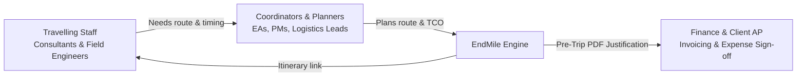
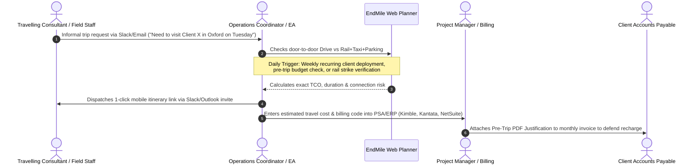
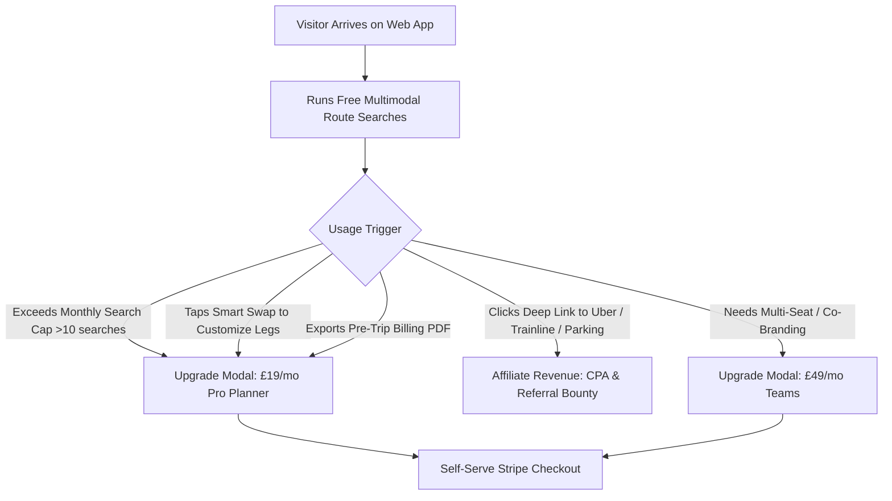
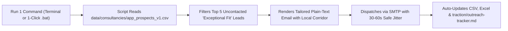

# B2B Consultant & Field Travel Acquisition: Market Ecosystem, Acquisition Channels & Commercial Monetization Strategy

*Last updated: 2026-10-04*  
*Status: Approved Strategic Framework*  
*Related Specifications: [`b2b-pretrip-pdf-justification.md`](b2b-pretrip-pdf-justification.md), [`.agents/product-marketing.md`](../.agents/product-marketing.md), [`.agents/customer-feedback.md`](../.agents/customer-feedback.md)*

---

## 1. Executive Summary: Grounding Discovery in Lean Unit Economics

A deep market exploration of our high-engagement organic user profile (frequent UK route planning for traveling staff) reveals a massive, underserved ecosystem across UK professional services, tech consultancies, engineering field services, and inspection teams.

However, a fundamental startup law governs this strategy: **Top-of-funnel visibility without a validated, frictionless monetization funnel burns cash and produces vanity metrics.** 

Attending multi-thousand-pound travel conventions (e.g., Business Travel Show), chasing broad press coverage in industry trade publications (e.g., *Business Travel News Europe*), or running speculative LinkedIn ad campaigns are **ineffective until self-serve monetization and retention are proven**.

This document consolidates:
1. The full **market ecosystem and stakeholder roles** beyond IT consulting.
2. The core **underlying operational, tax, and duty-of-care drivers**.
3. A **rigorous channel ranking** filtered through direct monetization viability, ROI, and our £37–£50/month operating burn.
4. The exact **monetization engine** that turns free searchers into paying subscribers.

---

## 2. Profile & Ecosystem Mapping: Who Else Travels Like This?

The pattern observed in our telemetry—frequent, routine lookups comparing multi-city UK travel routes across driving and rail—extends far beyond software consultancies.

### 2.1 Target Industry Verticals

| Industry Sector | Typical Travel Profile | Core Operational Dynamic |
|---|---|---|
| **Professional Services & Tech Consultancies** | Software consultants, IT implementation leads, cybersecurity auditors, digital transformation teams. | Dispatched from regional HQs (e.g., Leeds, Bristol, Poole) to client sites nationwide for multi-day or multi-week assignments. Travel is recharged to clients. |
| **Management, Strategy & HR Consultancies** | Management consultants, interim executives, executive search, change management leads. | High-frequency intercity travel between major UK commercial hubs (London, Birmingham, Manchester, Edinburgh). Time-sensitive, back-to-back client meetings. |
| **Legal & Accountancy Practices** | Commercial litigators, forensic accountants, regional audit teams. | Teams dispatched to client premises for statutory audits or hearings. Travel costs are scrutinized under strict client fee caps. |
| **Field Engineering, Utilities & Construction** | Commissioning engineers, maintenance technicians, utility surveyors, safety inspectors. | Moving between industrial parks, construction sites, and remote substations. Often driving-heavy, but facing high parking tariffs and CAZ/ULEZ charges. |
| **Healthcare, Biotech & Pharmaceuticals** | Clinical trials monitors, medical equipment specialists, pharmaceutical field reps. | Travel between NHS trusts, research hospitals, and regional clinics. Strict public-sector compliance and cost caps. |
| **Public Sector & Academic Inspectorates** | Ofsted inspectors, university external examiners, accreditation bodies. | Dispersed travel across institutional sites with fixed, tight public-purse travel budgets. |

---

### 2.2 Key Stakeholder Roles & Organizational Dynamics

In mid-sized organizations (50 to 500 staff), travel planning is rarely handled by a single dedicated travel department. It is fragmented across four distinct operational roles:



1. **The Travelling Staff (Consultants, Field Engineers, Auditors):**
   - *Behavior:* Often forced to self-plan trips or accept clumsy company bookings. In smaller firms, they choose habitual routes.
   - *Pain:* Stressed by tight train connections, unexpected station parking walk times, delayed transfers, and the risk of out-of-pocket expense rejections.
2. **The Operations / Travel Coordinator ("The Dispatcher" / EA / PA / PM):**
   - *Behavior:* Schedules travel for 5 to 50 consultants per week. Evaluates whether someone should drive or take the train based on schedule and budget.
   - *Pain:* Juggling 3+ tabs (Google Maps, Trainline, station parking websites) to calculate door-to-door journey viability. Manually typing itineraries into emails.
3. **Project Managers & Practice Leads:**
   - *Behavior:* Own project P&L. They sign off on consultant travel expenses before billing clients.
   - *Pain:* Margin leakage when travel expenses blow past project budget caps or when clients push back on expensive travel recharges.
4. **Finance, HR & Accounts Payable (AP):**
   - *Behavior:* Audits expense receipts, processes reimbursements, submits client recharge invoices, and prepares annual Scope 3 emissions reporting.
   - *Pain:* Disputed client invoices, HMRC compliance risks (fuel VAT reclaims, AMAP audits), and lack of centralized route-level carbon data for PPN 06/21 mandates.

### 2.3 Real-World Job Titles in Mid-Market UK Firms (50–300 Staff)
In companies of this size, dedicated "Travel Managers" do not exist. Outreach and targeting must focus on the operational generalists who inherit the travel planning chore:
- **Operations Coordinator / Operations Analyst**
- **Practice Manager / Practice Administrator**
- **Resource Manager / Scheduling Coordinator**
- **Project Support Officer (PSO) / Project Coordinator**
- **Executive Assistant (EA) / PA to Managing Director / Partner**
- **Office Manager / Facilities & Business Support Lead**

### 2.4 The Daily Operational Micro-Workflow & System Handoffs
What actually happens when a user runs 1–2 searches a day?



1. **The Request Trigger:** A consultant or engineer informally notifies the coordinator via Slack or Outlook: *"I need to be on-site at Client X on Tuesday morning."*
2. **The Daily 1–2 Route Check:** The coordinator evaluates the specific route:
   - *Why 1–2 searches daily?* In mid-tier firms, consultants rotate through 1–2 client assignments per week, or coordinators verify key legs the day before travel to check for schedule/fare changes or rail industrial action.
3. **The Current Manual Workaround ("Email, Spreadsheets & Accounting"):**
   - Without EndMile, the coordinator opens Google Maps (for driving time/mileage), Trainline (for rail fares/times), a station parking site, and guesses a taxi fare.
   - They manually sum the costs, calculate HMRC 55p mileage, and paste the text into an Outlook invite or Slack DM.
4. **The Billing & PSA Handoff:**
   - The coordinator or PM inputs the travel cost estimate into the firm's Professional Services Automation (PSA) tool (e.g., Kimble, Kantata, NetSuite, Xero Projects) tagged to the client's project billing code.
5. **The Purchasing Authority:**
   - While travel spend belongs to PMs/Finance, a **£19–£49/month SaaS subscription sits well within the discretionary spend limit of an Operations Lead or Office Manager’s corporate credit card (P-Card)** without requiring a multi-stage IT/procurement review.

---

## 3. Underlying Dynamics & Pain Points

Why do these professionals need an integrated multimodal engine rather than Google Maps or Trainline?

### 3.1 The 55p AMAP vs Rail TCO Arbitrage
- Effective April 2026, the HMRC Approved Mileage Allowance Payment (AMAP) rate is **55p/mile** (first 10,000 miles).
- A 220-mile round trip (e.g., Poole to Oxford or Leeds to Birmingham) costs **£121 in mileage alone**.
- When client AP departments see a £121 driving claim, they often search Trainline, spot a £65 advance train fare, and dispute the recharge.
- **The Blindspot:** The client auditor forgets that taking the train requires £15 station parking, £25 in destination taxis, and 2 extra hours of consultant transit. True rail TCO is £105+.
- **The Solution:** A defensible pre-trip comparison proving that the chosen route was cost-effective and operationally justified before travel commenced.

### 3.2 Duty of Care & Journey Risk
- Employers have a statutory duty of care. Sending staff on itineraries with 4-minute train connections or during known industrial action strands employees and blows client commitments.
- Standard consumer apps do not highlight connection fragility or transfer buffers.

### 3.3 Scope 3 Category 6 Carbon Accounting (PPN 06/21)
- UK consultancies bidding for central government, NHS, or tier-1 corporate contracts must provide verified Carbon Reduction Plans (CRPs).
- Retrospective spend-based carbon calculations are increasingly rejected by auditors; firms require **route-level, activity-based carbon reporting** aligned with UK DEFRA/DESNZ GHG factors.

### 3.4 Tool Fragmentation ("The 3-App Trap")
- Google Maps gives driving times but ignores parking tariffs, train ticket classes, and rail disruption.
- Trainline stops at the station curb—ignoring first-mile car parks and last-mile taxis.
- Users waste 15–30 minutes per journey manually stitching together routes in spreadsheets.

---

## 4. Acquisition Channels: The Commercial Monetization Gate

Many marketing channels look attractive in theory, but fail in practice due to poor unit economics. We apply a strict **Monetization Gate**: *Does this channel deliver high-intent users directly into a paying workflow at an acquisition cost well below Lifetime Value (LTV)?*

```
Monetization Reality Check:
[Channel] -> [Acquisition Cost (CAC)] -> [Conversion Path] -> [Net Unit Margin]
```

### Channel Evaluation Matrix

| Acquisition Channel | Feasibility | Expected CAC | Direct Monetization Path? | Commercial Recommendation |
|---|---|---|---|---|
| **Direct Sniper Cold Outreach** | High | Low (<£5/lead) | **YES**: Target named logistics leads/EAs at 100-person consultancies with a free trial of Pro Planner (£19/mo). | **TIER 1 (Immediate Execution)** |
| **High-Intent Search / SEO** | High | Low (organic) | **YES**: Inbound searchers looking for HMRC mileage calculators and consultant travel tools hit the web app directly. | **TIER 1 (Immediate Execution)** |
| **In-App Viral PLG Loop** | High | £0 (built-in) | **YES**: Pre-trip PDFs sent to client AP and mobile links sent to travelling consultants drive viral awareness. | **TIER 1 (Immediate Execution)** |
| **Targeted LinkedIn Thought Leadership** | Medium | Medium (time) | **YES**: Founder posts breaking down real route economics (55p/mi vs rail) convert followers to web app searchers. | **TIER 2 (Secondary / Routine)** |
| **Specialized Online Communities** | Medium | Low (time) | **CONDITIONAL**: Answering real questions in r/consulting or EA forums without overt pitching. | **TIER 2 (Opportunistic)** |
| **Paid Digital Ads (LinkedIn Ads)** | Low | Very High (£8–£15 CPC) | **NO**: Spending £150+ to acquire a £19/mo subscriber produces negative unit economics. | **DO NOT PURSUE** |
| **Trade Shows & Conventions (e.g. Business Travel Show)** | Very Low | Extremely High (£2k–£5k) | **NO**: Expensive booths and passes; enterprise buyers here want 6-figure TMC integrations, not £19/mo SaaS. | **DO NOT PURSUE (Vanity Trap)** |
| **Broad Industry PR & News Articles** | Low | High (PR fees / time) | **NO**: Generates untargeted vanity traffic with negligible subscription conversion. | **DO NOT PURSUE (Vanity Trap)** |
| **Enterprise TMC Partnerships (AMEX GBT / BCD)** | Low | High (12-18 mo cycles) | **NO**: Requires enterprise compliance, custom APIs, and revenue share before product-market fit. | **DEFERRED (Phase 4+)** |

---

## 5. Tier 1 Execution Playbook: How We Acquire & Monetize

### 5.1 Playbook A: Direct Sniper Outreach (High-Converting Outbound)

- **Target Persona:** Operations Managers, Travel/Logistics Coordinators, Executive Assistants, and Practice Managers at UK IT consultancies, engineering consultancies, and commercial law firms (50–300 employees).
- **List Building:** Build targeted lists of 100–150 verified prospects using LinkedIn and corporate website directories.
- **The Angle:** Margin protection and saving 2 hours/week of route-checking admin.
- **Outbound Email Hook:**
  > **Subject:** Quick question on consultant travel recharges at [Company]  
  > 
  > Hi [Name],  
  > 
  > With HMRC mileage at 55p/mile, a 200-mile round trip to a client site now bills at £110 + VAT—making travel recharges a frequent friction point with client accounts payable.  
  > 
  > We built EndMile to help UK consulting and field teams compare true door-to-door travel costs (driving mileage + parking vs train + station parking + taxi) in one search, and generate a 1-click Pre-Trip Justification PDF to attach to client invoices.  
  > 
  > Would it be useful to test a complimentary Pro account for your team's upcoming client dispatches?

---

### 5.2 Playbook B: High-Intent Programmatic & Targeted Content (Inbound SEO)

Instead of generic "business travel tips," focus programmatic and editorial content on exact high-intent problem queries that coordinators and finance admins type into Google:
1. *"train vs car cost calculator UK"*
2. *"fuel vs train fare calculator UK"*
3. *"55p per mile calculator UK"*
4. *"rail + taxi route cost UK"*
5. *"UK door-to-door journey planner"*
6. *"How to justify consultant travel recharges to client accounts payable"*
7. *"DEFRA Scope 3 business travel emissions calculator per journey"*

**Conversion Mechanism:** 
- Keep the landing page friction zero ("Try before you buy"). Users run a live route comparison immediately without an upfront account or credit card.
- The conversion gate triggers when they want to **export the Pre-Trip PDF**, **save more than 3 scheduled routes**, or **generate a shareable mobile itinerary with project billing codes**.

---

### 5.3 Playbook C: The In-Product Viral Loop (PLG Engine)

Every trip planned in EndMile acts as a customer acquisition engine:
1. **The PDF Audit Attachment:** Sent to client Accounts Payable and internal CFOs. Every exported PDF features:  
   `"Generated via EndMile Pre-Trip Travel Intelligence • Verify audit trail at endmilerouting.co.uk"`
2. **The Mobile Itinerary Link:** Dispatched to the travelling consultant. When the consultant opens the mobile link on their phone, they see a fast, pristine itinerary with a banner:  
   `"Planned with EndMile • Try it for your next trip"`

---

## 6. The Monetization Funnel & Paywall Architecture

Industry benchmarks on B2B calculation and pre-booking decision tools prove that pure freemium yields only 3–4% conversion. However, combining **usage volume caps with feature gating (Smart Swap) and affiliate exit monetization** increases conversion to **7.4%–10%+** while generating transaction revenue from unpaying searchers.



### Packaging & Pricing Tiers

1. **Free / Evaluation Tier (£0/mo):**
   - Up to **10 free searches per calendar month** (allows ad-hoc planning and proof of value).
   - Standard route comparison with basic default legs.
   - Outbound taxi and parking deep links monetized via affiliate partner tracking (Uber, Trainline Partnerize, JustPark Awin).
   - 1 lifetime watermarked PDF export.
2. **Pro Planner (£19/mo or £190/yr):**
   - **Unlimited route searches & advance scheduling.**
   - **Unlimited Smart Swap leg customization** (swapping slow walks/buses to station taxis or express tubes).
   - **Unlimited unwatermarked Pre-Trip Justification PDFs** with client billing codes for invoice defense.
   - Custom HMRC mileage presets (55p, 45p, EV rates).
   - Self-serve credit card checkout (under the £50/mo departmental P-Card threshold).
3. **EndMile Teams (£49/mo or £490/yr):**
   - Up to 3 coordinator seats.
   - Co-branded PDFs and mobile itineraries (upload company logo).
   - Aggregated DEFRA Scope 3 Category 6 CSV exports for corporate reporting.
   - Batch monthly billing reconciliation for Xero/Sage.

### The Affiliate Exit Layer (Capturing Tab-Closing Searchers)
When a user evaluates a route and clicks an outbound link without subscribing to Pro:
- **Station Parking:** Redirects to JustPark via Awin (up to 20% CPA on parking bookings).
- **Rail Booking:** Redirects to Trainline via Partnerize (0.5%–20% CPA).
- **Station Taxi / Uber:** Launches taxi deep links with partner referral parameters.
This guarantees that even if an on-screen searcher never enters a credit card, their exit to book still generates immediate commercial yield.

---

## 7. Automated Prospect Sourcing & Companies House API Methodology

To enable frictionless, sustainable B2B acquisition for a founder working two jobs, prospect generation must be rigorous, automated, and zero-cost (no LinkedIn Sales Navigator / Premium subscription).

### 7.1 Data Architecture & Enrichment Stack
- **Generator Scripts:** [`scripts/build_full_universe_pipeline.py`](../scripts/build_full_universe_pipeline.py) (universe 1,600+ company generator), [`scripts/build_massive_app_pipeline.py`](../scripts/build_massive_app_pipeline.py), and [`scripts/build_app_prospects_pipeline.py`](../scripts/build_app_prospects_pipeline.py).
- **Primary Source:** **Companies House REST API** (`api.company-information.service.gov.uk`) bulk Advanced Search using API key authentication (`2f9f5eed-3be4-43aa-9761-353d9067fdc1`).
- **Enrichment Source:** Antigravity web search, Google Maps, and outward postcode geo-resolution across 80+ UK cities and travel corridors.
- **Output Files:**
  - Authoritative CSV: [`data/consultancies/app_prospects_v1.csv`](../data/consultancies/app_prospects_v1.csv) (1,613 verified leads).
  - Formatted Excel: `C:\Users\isaac\Downloads\endmile app prospects v1.xlsx` (1,613 rows with styled forest-green headers, freeze panes, auto-fit columns, and colored tier badges).

### 7.2 Strict Lead Quality Gates & Filtering Rules
To avoid wasting outreach touches on solo contractors or dormant shells:
1. **Filing Type Audit:** Companies House `accounts.last_accounts.type` is strictly audited.
   - `micro-entity` and `dormant` are **excluded** (indicates 1-person umbrella companies or empty holding entities).
   - `small`, `medium`, `full`, `group`, and `total-exemption-full` are **retained** (confirms active operational payroll and mid-market scale).
2. **Company Status & Longevity:** Must be `active` and established prior to 2023 (>3 years operating history). Dissolved or liquidated entities are screened out.
3. **Anti-Contractor Heuristics:** Screened using regex to eliminate 1-person personal service names (e.g. "John Smith Consulting Ltd"). Requires positive commercial consulting keywords (Software, Engineering, Advisory, Systems, Technologies, Partners, Solutions).
4. **SIC Code Targeting:** Filtered by high-travel UK standard industrial classifications:
   - `62012` (Business and domestic software development)
   - `62020` (Information technology consultancy activities)
   - `62090` (Other information technology service activities)
   - `70229` (Management consultancy activities other than financial management)
   - `71122` (Engineering related scientific and technical consulting)
5. **Verified Operational Inboxes:** Leads must have a live, non-bouncing general or operational inbox (`info@`, `hello@`, `logistics@`, `enquiries@`, `contact@`) to ensure immediate outreach without guessing personal email formats.

### 7.3 Rigorous Lead Fit Scoring & Tiering System

| Tier | Score Range | Count | Definition & Characteristics | Target Action |
|---|---|:---:|---|---|
| **Exceptional Fit** | **90–100** | **669** | Established regional UK practice outside London (>7 years operating history or LLP/PLC), 50–300 staff, verified client-site travel model (software, engineering, healthtech, ecology), known regional travel corridors (e.g., Leeds ➔ London, Bristol ➔ Reading), verified operational contact. | Priority Batch 1. Send Campaign 3 Email 1 (10-minute multi-tab scratchpad angle). |
| **Strong Fit** | **80–89** | **886** | Mid-tier UK consultancy (30–120 staff, 3–7 years operating history), regional travel footprint, active consulting team. | Priority Batch 2. Send Campaign 3 or Campaign 2 (55p mileage dispute angle). |
| **Moderate Fit** | **70–79** | **58** | London-headquartered or specialized sub-sector practice with active client travel. | Backlog / Inbound conversion. |


---

## 8. The 10-Second Daily Automated Outreach Routine (No Need to Open Excel)

Because the founder works two full-time jobs, outreach is fully automated via a CLI dispatcher that requires **zero manual data entry, zero copying and pasting, and zero opening of spreadsheets**.



### Method 1: Automated 1-Command Dispatch (Recommended — 10 Seconds)
1. **Preview Mode (Optional):**
   ```bash
   npm run outreach:preview
   # Or: python scripts/outreach/send_app_outreach.py --dry-run --limit 5
   ```
2. **Live Automated Send (Daily 5 Leads):**
   ```bash
   npm run outreach:send
   # Or: double-click scripts/outreach/send_daily_batch.bat
   ```
   - Automatically selects the next 5 uncontacted consultancies with score 90–98.
   - Cleans the company name (stripping legal noise like LIMITED or LTD).
   - Injects their local travel corridor and HQ city into Campaign 3 (the 10-minute multi-tab scratchpad angle).
   - Pauses 30–60 seconds between sends to protect domain reputation and avoid spam filters.
   - Automatically marks the leads as `Sent` in `data/consultancies/app_prospects_v1.csv` and synchronizes `C:\Users\isaac\Downloads\endmile app prospects v1.xlsx`.
   - Automatically logs the outreach in `traction/outreach-tracker.md`.

### Method 2: Manual Excel Inspection (Optional)
If you ever want to visually review the database:
1. Open `C:\Users\isaac\Downloads\endmile app prospects v1.xlsx`.
2. Review the color-coded tiers (`Exceptional Fit` in green, `Strong Fit` in blue).
3. The `OutreachStatus` and `DateSent` columns will already reflect any automated sends.

---

## 9. Action Plan & Next Steps

1. **Keep Focus Tight:** Reject expensive convention attendance and broad PR campaigns until monthly recurring revenue (MRR) justifies brand marketing.
2. **Launch Daily 5-Touch Routine:** Execute 5 personalized outreach touches per morning using `endmile app prospects v1.xlsx`.
3. **Monitor In-App Funnel:** Track PostHog events (`share_menu_opened`, `pdf_report_exported`, `saved_journeys_count`) to verify coordinator conversion triggers.
4. **Follow Up with Paul Hardy:** Execute follow-up with Dorset Software Services (`logistics@dorsetsoftware.com`) providing a 10-second feasibility walkthrough and free Pro trial pitch before his next trip on 5 Oct.

