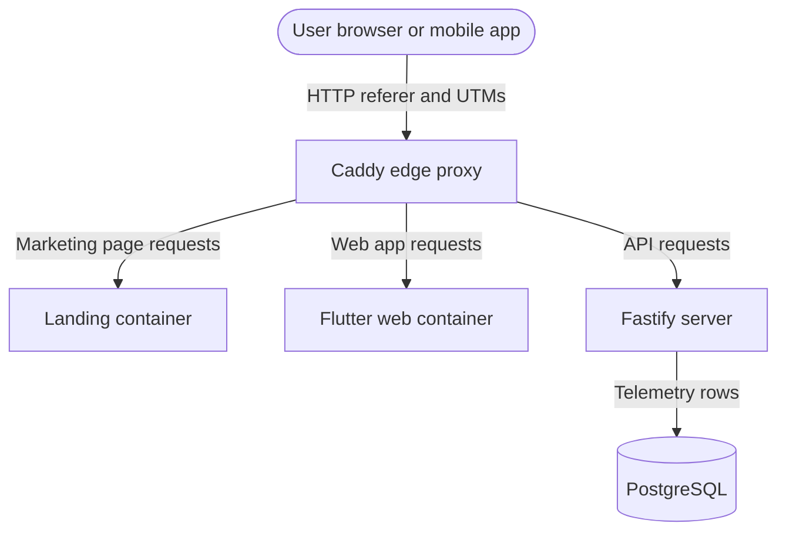

# EndMile Forensic Discovery and Telemetry Playbook

This playbook explains how to trace signups, search behavior, and referral
channels from first-party production telemetry. Keep examples generic: do not
commit raw IP addresses, user names, email addresses, or one-off production log
lines.

---

## Core Telemetry Stack

Client-side analytics can be blocked by browser privacy tools, so production
investigations should reconcile PostHog with first-party server evidence.



## Step 1: Audit Database Telemetry

Run database checks from the PostgreSQL container or a privileged admin shell.
Prefer hashed identifiers and bounded time windows in notes and reports.

### Recent Signups

```sql
SELECT
    id,
    email,
    display_name,
    tenant_id,
    created_at
FROM users
ORDER BY created_at DESC
LIMIT 5;
```

When recording findings, redact direct identifiers unless there is a specific
operational reason to keep them in a private incident record.

### Recent Search Details

```sql
SELECT
    user_id,
    origin_name,
    dest_name,
    searched_at,
    search_date_time,
    selected_modes
FROM recent_searches
WHERE user_id = '<user-id>'
ORDER BY searched_at DESC;
```

### Raw Endpoint Calls

`endpoint_calls.client_id` stores a daily-salted hash rather than a raw client
IP. Use it to correlate requests without copying IP addresses into repo docs.

```sql
SELECT
    created_at,
    method,
    path,
    status_code,
    client_id
FROM endpoint_calls
WHERE created_at >= '<start timestamp>'
  AND created_at < '<end timestamp>'
ORDER BY created_at ASC;
```

## Step 2: Classify Platform Source

Use first-party endpoint attribution first. New search traffic writes
`endpoint_calls.client_surface`, `client_feature`, `source_kind`, and
`source_id` from validated telemetry-only headers. These fields are not used
for auth, tenancy, or security decisions.

Expected values:

- `app / journey_search / none`: Flutter mobile or web app journey search.
- `guide / live_widget / venue / <venueId>`: B2C Guide venue live-widget search.
- `matrix_cli / matrix_batch / none`: batch matrix generation.
- `agent_cli / analysis / none`: future agent-owned analysis calls.
- `unknown`: absent or invalid attribution headers.

For older rows without these fields, or for traffic that predates the
attribution migration, fall back to request path and web container logs to
classify whether the activity came from the native mobile app, the web app, or
the landing page.

```text
Database search at time T
        |
        v
Any landing/web-app Nginx traffic around T?
        |
        +-- no  -> likely native app or direct API client
        |
        +-- yes -> inspect which container logged the request
                  landing: marketing page visit
                  web-app: Flutter web app visit
```

### Native Mobile App

The database records a search and Fastify logs a `POST /journeys/search/stream`
call, but the landing and web-app containers have no matching page or asset
requests around the same timestamp.

### Landing Page Referral

The landing container logs a page request shortly before signup or search
activity.

```bash
docker compose logs landing | grep '<timestamp fragment>'
```

### Direct Web App

The web-app container logs Flutter web assets, such as `/main.dart.js`, around
the activity timestamp.

```bash
docker compose logs web-app | grep '<timestamp fragment>'
```

## Step 3: Extract Referral Sources

When a visitor lands on the site, inspect referer and UTM values from Nginx
logs. Redact the client IP and avoid committing full raw log lines.

```text
landing-1 | <internal-ip> - - [timestamp] "GET /?utm_source=chatgpt.com HTTP/1.1" 200 ... "https://chatgpt.com/" "Mozilla/5.0 (...)" "<redacted-client-ip>"
```

Common patterns:

- Google organic search: referer contains `https://www.google.com/`.
- AI referral: referer contains `https://chatgpt.com/` or UTM source is
  `chatgpt.com`.
- Messaging previews: user agent contains a link-preview crawler such as
  `facebookexternalhit`, `WhatsApp`, `Slackbot-LinkExpanding`, or
  `Discordbot`.

## Step 4: Run Joined Guide Performance Analysis

Use the CLI for bounded Guide analysis that joins GSC, GA4, and first-party API
telemetry:

```bash
node scripts/analytics/guide-performance.mjs --days 28 --markdown
node scripts/analytics/guide-performance.mjs --days 28 --surface guide --json
node scripts/analytics/guide-performance.mjs --days 7 --surface guide --ssh-db deploy@155.133.23.54 --markdown
node scripts/analytics/guide-performance.mjs --days 28 --surface guide --ssh-db deploy@155.133.23.54 --gsc-google-cloud-config C:\Users\isaac\.gcloud-endmile-gsc --ga4-google-cloud-config C:\Users\isaac\.gcloud-endmile-analytics --markdown
node scripts/analytics/guide-performance.mjs --venue-id 130231837 --page guide.endmilerouting.co.uk/venues/leicester-magistrates-court-130231837/
```

Live mode needs:

- `ANALYTICS_DATABASE_URL` or `DATABASE_URL` with read access to
  `endpoint_calls` and `api_calls`, or `--ssh-db deploy@155.133.23.54` to query
  the VPS Postgres container through `docker compose exec`.
- Google auth through `GOOGLE_ACCESS_TOKEN` or `gcloud auth application-default
  print-access-token`. Direct CLI tokens need both Search Console and GA4
  readonly scopes. The current local setup uses split ADC configs:
  `C:\Users\isaac\.gcloud-endmile-gsc` for GSC as
  `isaacmwilloughby@gmail.com`, and
  `C:\Users\isaac\.gcloud-endmile-analytics` for GA4 as
  `isaacw@endmilerouting.co.uk`.
- GSC site default: `sc-domain:endmilerouting.co.uk`.
- GA4 property default: `properties/531529105`.

For `--surface guide`, the CLI filters GSC/GA4 to
`guide.endmilerouting.co.uk` unless `--page` is supplied. It reports SEO rows,
GA4 event counts, API searches by surface, cache hit rate, estimated OJP cost,
and opportunity lists for weak CTR, no widget starts, widget errors, and slow
API groups.

## Step 5: Privacy Rules

- Do not commit raw IP addresses, emails, full names, or one-off production log
  lines.
- Keep `endpoint_calls.client_id` hashed with a daily salt.
- Keep endpoint attribution coarse. `source_id` may store a venue ID, but it
  must not store entered postcodes, raw coordinates, full page URLs, emails, or
  other personal data.
- Use short, bounded timestamps and aggregate findings in repo docs.
- Keep detailed incident evidence in an access-controlled private location.
- Ensure the public privacy policy describes standard first-party operational
  logging.
