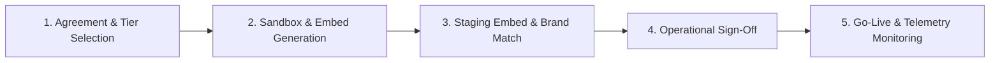

# Venue Widget Onboarding, Approval & Go-Live Playbook

*The operational guide for onboarding UK cultural venues, theatres, and attractions when they agree to install the EndMile 'Plan Your Visit' widget.*

---

## 1. Executive Summary

When a venue (Theatre, Museum, Heritage Site, University) expresses interest or agrees to pilot the EndMile travel widget, they need a frictionless, zero-risk pathway from agreement to live embed.

Unlike enterprise competitors (You. Smart. Thing.) whose onboarding requires a 6-week G-Cloud procurement cycle, £2,250 setup fee, and custom dev work, EndMile's onboarding is designed to be completed in **under 24 hours** with **zero technical friction**.

---

## 2. The 5-Step Venue Onboarding & Approval Process



### Step 1: Commercial Agreement & Tier Confirmation
- **Sign-off Persona:** Head of Visitor Experience, Commercial Director, or Marketing Lead.
- **Offering:** 14-day free trial on staging/live $\rightarrow$ converts to £19/mo (Standard) or £49/mo (Pro with Scope 3 carbon exports and custom CSS).
- **Payment Method:** Monthly corporate card (Stripe) or direct debit/invoice. Zero setup fees.

### Step 2: Sandbox & 1-Line Embed Script Generation
We generate their unique venue configuration snippet:

```html
<!-- EndMile 'Plan Your Visit' Widget Embed -->
<div id="endmile-travel-widget" data-venue-id="VENUE_SLUG" data-theme="light"></div>
<script 
  src="https://guide.endmilerouting.co.uk/widget.js" 
  async 
  defer>
</script>
```

#### Configurable Attributes:
- `data-venue-id`: Slug matching our verified venue database (e.g. `harrogate-theatre`).
- `data-theme`: `light`, `dark`, or `auto` (matches host site CSS).
- `data-accent-color`: Hex color matching the venue's brand palette (e.g. `#8B1E3F`).
- `data-layout`: `drawer` (mobile-first slide-up) or `inline` (embedded block on "Getting Here" page).

### Step 3: CMS Installation (Technical Feasibility)
The venue webmaster, agency, or marketing manager pastes the 2-line snippet into their CMS:

| CMS Platform | Installation Method | Typical Time |
|---|---|---|
| **WordPress** | Add a "Custom HTML" block on the "Getting Here" / "Visit Us" page. | 2 minutes |
| **Squarespace** | Add a "Code" block on the Visit page; paste script. | 2 minutes |
| **Wix** | Embed element $\rightarrow$ "Embed a widget" / HTML iframe code. | 3 minutes |
| **Drupal / Custom** | Paste into the page template or CMS body with raw HTML enabled. | 5 minutes |

### Step 4: Verification & Approval Checklist (Pre-Launch Testing)
Before flipping the switch on live traffic, both Isaac and the venue verify:
- [ ] **Mobile Responsiveness:** Drawer expands smoothly on iOS Safari and Android Chrome without layout shifts (CLS < 0.1).
- [ ] **Destination Lock:** Destination is locked to the venue's exact entrance coordinates and postcode.
- [ ] **Transit & Parking Options:** Verified that local rail stations, bus stops, and official car parks (with correct tariffs) are accurately suggested.
- [ ] **Accessibility:** Screen-reader accessible calling points and high-contrast transit steps.
- [ ] **Stakeholder Approval:** Operations Manager verifies local parking advice matches their venue policies (e.g. Blue Badge parking, drop-off bays).

### Step 5: Go-Live & Automated Telemetry Monitoring
- Page goes live.
- EndMile telemetry begins logging route queries, origin postcodes, and mode selection (`Fastify` $\rightarrow$ `telemetry_searches` table).
- Founder schedules automated monthly CO2 report delivery.

---

## 3. Post-Launch Reporting & Retention (The Julie's Bicycle Engine)

Venues funded by Arts Council England (ACE) National Portfolio Organisations (NPOs) are legally required to report **Scope 3 audience travel emissions** annually via the **Julie's Bicycle Creative Climate Tools**.

### Near-Term: EndMile Venue Reporting CLI
Using our built-in telemetry CLI, the founder generates and emails a monthly executive PDF/Markdown report to the venue director:
- **Total Attendee Route Searches**
- **Modal Split:** % Public Transit, % Driving, % Walking/Cycling
- **Audience Carbon Footprint:** Total kg CO₂ generated vs kg CO₂ saved by diverted driving
- **ACE Julie's Bicycle Export:** Pre-formatted values ready to copy directly into the ACE portal

### Later Phase: Self-Serve Venue Webapp Portal
A dedicated dashboard (`venues.endmilerouting.co.uk`) where venue directors can:
1. View real-time attendee traffic and modal split.
2. Customize widget appearance, branding, and default announcements (e.g. "Roadworks on High Street tonight").
3. One-click export of Julie's Bicycle Scope 3 annual audit certificates.
4. Self-serve billing and subscription management.
