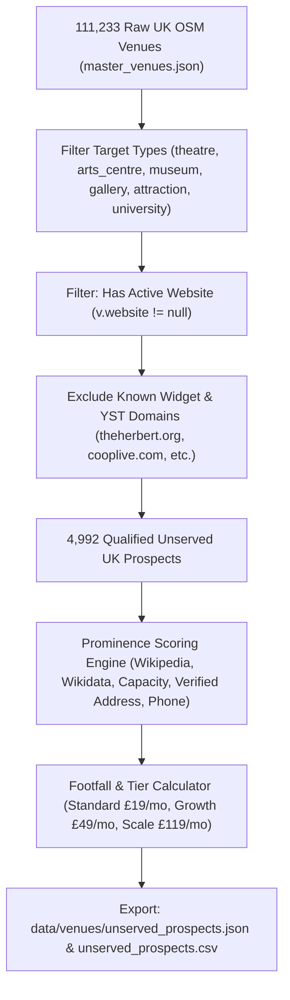

# EndMile Venue Travel Widget: Master Outbound Sales Playbook & Prospecting Engine

*Single source of truth for B2B venue outreach, competitor intelligence, and unserved prospect discovery.*
*Last updated: 2026-09-25*

---

## 1. Strategic Context & Competitor Ground Truth

### 1.1 The Market Dichotomy: Enterprise Procurement vs. The Unserved Mid-Market

The UK venue travel planning market is sharply divided into two extremes:

1. **Enterprise Procurement (You. Smart. Thing. / YST territory):**
   - **Target Clients:** Combined Transport Authorities (TfGM / Bee Network), Premier League / Tier 1 Stadiums (Co-op Live, CBS Arena, Headingley, Emirates Old Trafford), and Mega-Events (Wimbledon / AELTC, Glasgow Summer Sessions).
   - **Cost Structure (Crown Commercial Service G-Cloud 14 Rate Card):**
     - Day rate: **£750 / day** (exclusive of VAT).
     - Single-location onboarding: **~3 days minimum (£2,250 setup fee)**.
     - Multi-location onboarding: **~15 days (£11,250 setup fee)**.
     - Bespoke ticketing/CRM integration: **£750 / day**.
     - Messaging fees: **£0.10 per SMS**.
     - Annual platform licence: Bespoke 5-figure enterprise contract.
   - **Technical Stack:** Embedded iframe (`<iframe src="https://travel.yousmartthing.com/bee_network">`) loading OpenTripPlanner (OTP), MapTiler vector tiles, UserWay accessibility overlay, and private Matomo telemetry.
   - **The Reality:** An independent regional theatre or civic museum cannot justify £2,250 upfront setup fees plus enterprise annual retainers for travel directions.

2. **The Non-Paying / Ticketing Platform Cohort ("TicketSource Users"):**
   - Venues like Red Ladder Theatre Company or St. John's Parish Hall linking to `travel.yousmartthing.com` are **not paying clients**.
   - TicketSource built an automated integration placing a generic travel assistant link into event confirmation emails.
   - These micro-venues have zero software budget and will not purchase a standalone SaaS widget.

3. **"Ghost" Slugs (Transit Trials & Municipal Projects):**
   - Slugs like `36-leeds-harrogate-ripley`, `1-lincoln-grantham`, and `17-blackpool-lytham` are **not venues**—they are transit corridor trials mapping bus routes (e.g. Transdev Route 36).
   - Slugs like `147_Nightclub`, `AfriLicken_Junction`, and `2-Tone_Village` were generated during a one-off 2021 Coventry City of Culture municipal grant; almost all are dormant.

4. **The Competitor Flaw (The Iframe Trap):**
   - Prominent cultural institutions (including the **Ashmolean Museum** at `ashmolean.org/directions` and **Pitt Rivers Museum** at `prm.ox.ac.uk/visit-us`) partnered with YST, but gave up embedding their heavy (~10MB, 600px rigid desktop height) iframe.
   - Because the iframe broke their mobile website layouts and caused double scrollbars, they downgraded to a plain text outbound link (`travel.yousmartthing.com`), bouncing visitors off their website.

### 1.2 The EndMile Strategic Wedge: Zero Competition with YST

> **Core Operating Rule:** We do NOT compete with You. Smart. Thing. for five-figure public transport authority or mega-stadium tenders. We leave TfGM and Co-op Live to them.

Instead, EndMile attacks the massive, neglected middle market: **the 4,992 UK cultural and visitor destinations that have NO travel widget installed at all.**

- **Setup Fee:** **£0** (vs. YST's £2,250+).
- **Implementation:** **1 line of HTML script/iframe** (under 2 minutes).
- **Price Point:** **£19 to £49 / month** self-serve on credit card (no committee tenders, no G-Cloud procurement).
- **Mobile-First UX:** Lightweight, 100% fluid responsive embed (no double-scrollbars, zero layout shift).
- **Unique Capabilities:** Door-to-door multimodal routing (driving + parking vs rail + walk), real-time parking tariffs, Clean Air Zone (CAZ) alerts, and one-click Julie's Bicycle Scope 3 carbon reporting for Arts Council England (ACE) National Portfolio Organisations.

### 1.3 Traffic & Usage Modeling: How Many Visitors Use a Venue Widget?

Venues and competitors do not expose public search counters. Telemetry is sent to private endpoints. However, travel intent search volume can be accurately predicted using this footfall-to-search mathematical model:

$$\text{Monthly Web Sessions} \approx \frac{\text{Annual Footfall} \times 2.5}{12}$$

$$\text{Arrival Page Views} \approx \text{Monthly Web Sessions} \times 12\%$$

$$\text{Monthly Widget Searches} \approx \text{Arrival Page Views} \times 8\%\text{ to }12\%$$

#### Benchmarks & Pricing Fit:
| Venue Size / Footfall | Monthly Web Sessions | "Getting Here" Pageviews | Est. Monthly Widget Searches | Recommended EndMile Tier |
|---|---|---|---|---|
| **Small / Boutique** (30k–80k visits/yr)<br>*e.g. Civic Art Gallery, 400-seat theatre* | 6,250 – 16,600 | 750 – 2,000 | **60 – 240** | **Standard (£19/mo)** |
| **Mid-Sized Cultural** (100k–350k visits/yr)<br>*e.g. The Herbert, Regional Repertory Theatre* | 20,800 – 72,900 | 2,500 – 8,750 | **200 – 1,050** | **Standard (£19/mo) / Growth (£49/mo)** |
| **Large Cultural / Attraction** (400k–1M+ visits/yr)<br>*e.g. Ashmolean, Eureka!, Major Heritage Site* | 83,000 – 208,000 | 10,000 – 25,000 | **800 – 3,000** | **Growth (£49/mo) / Scale (£119/mo)** |

---

## 2. The 4 Target Venue Archetypes

### Archetype 1: Independent Regional Theatres & Arts Centres (300 to 2,000 seats)

- **Target Universe:** 954 qualified UK venues in OSM dataset with active websites.
- **Examples:** Leeds Grand Theatre, Harrogate Theatre, York Theatre Royal, Sheffield Crucible, Nottingham Playhouse, Chichester Festival Theatre, Belgrade Theatre Coventry, His Majesty's Theatre Aberdeen.
- **Operational Reality:**
  - Strict arrival window: 80% of attendees arrive in a compressed 45-minute window (6:45 PM – 7:30 PM).
  - High friction around evening city centre parking: confusing multi-storey tariffs, evening event flat rates, Clean Air Zone (CAZ) charges.
- **The Front-Line Pain:**
  - Box office and front-of-house staff inundated with phone calls: *"Where should I park?", "Is Q-Park open late?", "Do I pay the CAZ fee?"*
  - Late-curtain disruptions: stuck drivers arriving 10 minutes after curtain up cause seating holds, auditoriums opening mid-performance, and lost bar revenue.
- **The Governance / Grant Pain:**
  - Arts Council England (ACE) National Portfolio Organisations (NPOs) must calculate and report Audience Travel Scope 3 Carbon to **Julie's Bicycle**. Most theatres do this via clumsy post-show email surveys with 4% response rates.
- **Target Personas / Job Titles:**
  - *Head of Visitor Experience / Operations Director*
  - *Front of House Manager / Box Office Manager*
  - *Executive Director / Chief Executive*
- **EndMile Value Hook:**
  - Deflects pre-show parking phone calls.
  - Door-to-door rail vs driving comparison prevents late-curtain arrivals.
  - Automated Julie's Bicycle Scope 3 audience travel carbon data export.
- **Recommended Tier:** Standard (£19/mo) or Growth (£49/mo).

---

### Archetype 2: Regional Civic & University Museums & Art Galleries

- **Target Universe:** 2,418 qualified UK venues in OSM dataset with active websites.
- **Examples:** Bar Convent Museum York, Bowes Museum Barnard Castle, Kelvingrove Art Gallery Glasgow, National Museum of the Royal Navy Portsmouth, Royal Armouries Leeds, Fitzwilliam Museum Cambridge, Ashmolean Museum Oxford.
- **Operational Reality:**
  - High proportion of family visitors, coach parties, and tourists unfamiliar with local geography.
  - Weekend morning surges (10:00 AM – 12:00 PM).
- **The Front-Line Pain:**
  - Reception and information desks overwhelmed by repetitive arrival inquiries: nearest station walks, blue badge parking spaces, bus connections.
  - Accessibility anxiety: visitors calling ahead to check step-free station routes, walking distances, and parking proximity.
- **The Governance / Grant Pain:**
  - Local authority net-zero 2030 targets and DCMS / ACE environmental reporting mandates.
  - Pressure to prove public transit accessibility and decarbonise visitor travel.
- **Target Personas / Job Titles:**
  - *Head of Visitor Services / Visitor Experience Manager*
  - *Operations Manager / Commercial Director*
  - *Marketing & Audience Development Director*
- **EndMile Value Hook:**
  - Answers all parking tariffs, blue badge options, and train station walking times in one live widget.
  - Blue badge and step-free transit routing built-in.
  - Zero IT burden: drop-in 1-line script that matches the museum's existing brand styles.
- **Recommended Tier:** Standard (£19/mo) or Growth (£49/mo).

---

### Archetype 3: Regional Visitor Attractions, Heritage Sites & Wildlife Parks

- **Target Universe:** 1,197 qualified UK venues in OSM dataset with active websites.
- **Examples:** Jorvik DIG, Parceval Hall Gardens, SS Great Britain, Black Country Living Museum, Yorkshire Wildlife Park, Beamish Museum, Prior Park Bath.
- **Operational Reality:**
  - Heavily car-dependent, often located in edge-of-town, rural, or historic urban settings with constrained road access.
  - Extreme peaks on bank holidays, sunny weekends, and school holidays.
- **The Front-Line Pain:**
  - On-site car park bottlenecks, tailbacks on local access roads, and complaints from local residents / parish councils.
  - Visitors missing timed-entry tickets because they got stuck in last-mile traffic or struggled to find overflow parking.
  - Inquiries regarding EV charger availability, coach drop-off points, and rural public bus connections.
- **Target Personas / Job Titles:**
  - *Director of Operations / General Manager*
  - *Visitor Experience Manager / Head of Commercial Operations*
- **EndMile Value Hook:**
  - Dynamically guides visitors to Park & Ride facilities, public rail corridors, or designated overflow car parks before they hit the access road.
  - Displays real door-to-door driving costs (fuel + parking) alongside train/bus options.
- **Recommended Tier:** Growth (£49/mo) or Scale (£119/mo).

---

### Archetype 4: Universities & Higher Education Campuses (Open Days & Visitor Centers)

- **Target Universe:** 423 qualified UK institutions in OSM dataset with active websites.
- **Examples:** University of Leeds, University of Manchester, Bristol, Derby, Solent, Royal Central School of Speech and Drama.
- **Operational Reality:**
  - 4 to 6 massive Open Days per year, plus graduation weeks and academic conferences.
  - 5,000 to 15,000 visitors arriving within a 2-hour window on a Saturday morning.
- **The Front-Line Pain:**
  - Campus car parks fill up within 30 minutes; campus security and parking attendants face angry parents and snarled surrounding arterial roads.
  - Conflicting travel instructions across disparate faculty pages, PDF maps, and generic Google Maps pins.
- **The Governance / Grant Pain:**
  - Strict Higher Education Decarbonisation and Campus Masterplan modal split commitments (mandating 70%+ public transit arrival).
- **Target Personas / Job Titles:**
  - *Head of Events & Conferencing / Student Recruitment Lead*
  - *Campus Travel & Sustainable Transport Manager*
  - *Head of Facilities / Estates Operations*
- **EndMile Value Hook:**
  - Dedicated "Open Day Travel Hub" embed routing parents directly to designated Park & Ride or university satellite car parks, not gridlocked main campus gates.
  - Live train fare and walking timetable integration reduces parental driving habit.
- **Recommended Tier:** Scale (£119/mo).

---

## 3. Modular Cold Email Construction Kit

*Written strictly according to `.agents/skills/cold-email/SKILL.md`: peer-to-peer voice, under 120 words, lowercase 2-4 word subject lines, zero AI buzzwords, interest-based low-friction ask.*

### 3.1 Strict Writing Principles
1. **Lowercase, boring subject lines:** Must look like an internal email from a colleague (`visitor directions`, `getting here page`, `parking queries`, `curtain times`). No title case, no exclamation marks, no product names.
2. **Ruthlessly concise:** Cut any sentence that doesn't advance the reply. Target length: **65–110 words**.
3. **No vendor language:** Never say "I hope this email finds you well", "We are the leading provider", "synergy", "leverage", or "game-changer".
4. **Lead with their world:** Focus on their front-of-house phone volume, curtain holds, or car park confusion.
5. **Low-friction CTA:** Never ask for a 30-minute phone call. Ask if they want a 2-minute drop-in preview of how it looks for their specific venue.

---

### 3.2 Modular Email Matrix (Mix & Match by Archetype)

Use this modular matrix to compose customized emails in seconds:

#### Slot 1: Subject Line Bank (Choose One)
- `visitor directions`
- `getting here page`
- `parking queries`
- `curtain times` *(for theatres)*
- `weekend visitor parking` *(for museums/attractions)*
- `open day directions` *(for universities)*

#### Slot 2: The Observation Hook (Choose One by Archetype)
- **Theatre Hook:** `Noticed the visitor directions on {{domain}} mention nearby parking for evening shows.`
- **Museum Hook:** `Saw the visit page on {{domain}} outlining station walks and local car parks.`
- **Attraction Hook:** `Took a look at the visitor arrival guide on {{domain}}.`
- **University Hook:** `Looked at the campus travel directions on {{domain}} ahead of upcoming visitor days.`

#### Slot 3: The Operational Problem Injection (Choose One by Archetype)
- **Theatre Pain:** `With evening curtain times, front-of-house teams usually get hit with the same questions about multi-storey rates, Clean Air Zone charges, and walking times from the station—and late arrivals still disrupt the first act.`
- **Museum Pain:** `Reception desks often spend the first two hours every morning answering repeated calls about parking charges, blue badge bays, and walking times from the station.`
- **Attraction Pain:** `On busy weekends and school holidays, visitors navigating car park capacity and last-mile driving create avoidable arrival congestion and late entries.`
- **University Pain:** `On open days, directing thousands of visiting families to the correct campus car parks without snarling local roads is always a headache for security.`

#### Slot 4: The Credibility / Solution Drop (Choose One)
- **General / Travel Solution:** `We built a lightweight 1-line "Plan Your Visit" widget for UK venues that compares door-to-door driving costs and parking tariffs against live train and bus times, keeping visitors on your site.`
- **The Arts / Julie's Bicycle Angle:** `It embeds in one line, guides audiences to preferred car parks or direct trains, and automatically tracks Scope 3 audience travel carbon for Julie's Bicycle reporting.`

#### Slot 5: The Low-Friction Ask CTA (Choose One)
- `Worth sending a 2-minute preview of how it looks for {{venue_name}}?`
- `Open to seeing a quick 2-minute preview for {{venue_name}}?`
- `Would a drop-in preview be useful to see?`

---

### 3.3 Ready-to-Send 3-Touch Campaigns by Archetype

#### Campaign 1: Independent Regional Theatres (e.g. Harrogate Theatre, York Theatre Royal)

**Touch 1 (Day 1) — Front-of-House Calls & Late Curtains**
```text
Subject: visitor directions

Hi {{FirstName}},

Noticed the visitor directions on {{domain}} mention nearby parking for evening shows.

With evening curtain times, front-of-house teams usually get hit with the same questions about multi-storey charges, CAZ fees, and walking times from the station—and late arrivals still disrupt the first act.

We built a lightweight 1-line "Plan Your Visit" widget for UK theatres. It shows audiences their exact door-to-door travel—comparing driving costs and parking tariffs directly against live train times so they arrive before curtain up.

Worth sending a 2-minute preview of how it looks for {{venue_name}}?

Best,
Isaac
EndMile
```

**Touch 2 (Day 4) — Julie's Bicycle Scope 3 Carbon Angle**
```text
Subject: quick follow up: {{venue_name}}

Hi {{FirstName}},

One quick detail I should have mentioned: if {{venue_name}} reports audience travel carbon to Julie's Bicycle for Arts Council England, the widget calculates audience modal split and CO2 automatically.

Saves running post-show travel surveys with 4% response rates.

Happy to send over a 2-minute interactive preview if useful?

Best,
Isaac
```

**Touch 3 (Day 9) — Polite Breakup**
```text
Subject: visitor directions

Hi {{FirstName}},

Assuming visitor travel and parking aren't top priorities right now.

I'll close the loop here, but feel free to reach out if you ever want to see the {{venue_name}} travel preview.

Best,
Isaac
```

---

#### Campaign 2: Regional Civic & University Museums (e.g. Bar Convent Museum, Royal Armouries)

**Touch 1 (Day 1) — Reception Desk Call Volume & Transit Comparison**
```text
Subject: getting here page

Hi {{FirstName}},

Saw the visit page on {{domain}} outlining local car parks and station walks.

Reception desks often spend the first hour of every morning fielding repeated questions about parking charges, blue badge spaces, and walking times from the station.

We built a lightweight 1-line "Plan Your Visit" widget for UK cultural venues. It lets visitors compare door-to-door driving costs and parking tariffs against live train and bus times in one view, right on your website.

Worth sending a 2-minute preview of how it looks for {{venue_name}}?

Best,
Isaac
EndMile
```

**Touch 2 (Day 4) — Accessibility & Civic Net-Zero Mandates**
```text
Subject: quick question: {{venue_name}}

Hi {{FirstName}},

Following up on my note below—the widget also highlights step-free train routes and accessible parking bays, which helps visitors with access requirements plan ahead before traveling.

Would a quick preview for {{venue_name}} be helpful to see?

Best,
Isaac
```

**Touch 3 (Day 9) — Polite Breakup**
```text
Subject: getting here page

Hi {{FirstName}},

Assuming visitor travel directions are working fine as they are.

I won't follow up again, but let me know if you ever want to test the interactive widget for {{venue_name}}.

Best,
Isaac
```

---

#### Campaign 3: Visitor Attractions & Wildlife Parks (e.g. Jorvik DIG, Prior Park)

**Touch 1 (Day 1) — Car Park Congestion & Timed Entries**
```text
Subject: weekend visitor parking

Hi {{FirstName}},

Took a look at the visitor arrival guide on {{domain}}.

On busy weekends and school holidays, visitors navigating car park capacity and last-mile driving often creates arrival congestion—and families arriving late miss their entry slots.

We built a lightweight "Plan Your Visit" widget that embeds on your site in one line. It routes visitors from anywhere in the UK, calculates driving vs rail costs, and guides cars to preferred parking or Park & Ride hubs before local roads snarl up.

Open to seeing a 2-minute preview for {{venue_name}}?

Best,
Isaac
EndMile
```

**Touch 2 (Day 4) — Peak Season Arrival Smoothing**
```text
Subject: peak travel preview: {{venue_name}}

Hi {{FirstName}},

Quick note—several attractions use the widget ahead of bank holidays and school breaks to divert traffic toward public transit or satellite parking before their main gates fill up.

Happy to share a 2-minute mock-up for {{venue_name}} if you'd like to take a look?

Best,
Isaac
```

**Touch 3 (Day 9) — Polite Breakup**
```text
Subject: weekend visitor parking

Hi {{FirstName}},

I'll assume parking and visitor routing are well in hand for the upcoming season.

I'll leave it here, but feel free to reach out anytime.

Best,
Isaac
```

---

#### Campaign 4: University Campuses (e.g. Derby, Solent, Royal Central)

**Touch 1 (Day 1) — Open Day Campus Travel & Local Congestion**
```text
Subject: open day directions

Hi {{FirstName}},

Looked at the campus travel guide on {{domain}} ahead of upcoming visitor days.

On open days, directing thousands of visiting families to the right campus car parks without snarling local roads is always a headache for security and events teams.

We built a lightweight travel hub widget that embeds directly on open day landing pages. It compares door-to-door driving costs and parking against rail timetables, routing drivers to designated Park & Ride lots rather than gridlocked campus gates.

Worth sending a 2-minute preview for {{venue_name}}?

Best,
Isaac
EndMile
```

**Touch 2 (Day 4) — Campus Modal Split Targets**
```text
Subject: modal split data: {{venue_name}}

Hi {{FirstName}},

Following up briefly—the widget also logs visitor origin postcodes and travel mode splits, providing concrete data for university sustainable travel and Scope 3 transport reporting.

Would a 2-minute preview for the {{venue_name}} campus be of interest?

Best,
Isaac
```

**Touch 3 (Day 9) — Polite Breakup**
```text
Subject: open day directions

Hi {{FirstName}},

Assuming campus event travel is completely sorted for now.

I'll close the loop here, but feel free to get in touch if you'd ever like to see how the open day travel hub works.

Best,
Isaac
```

---

## 4. Objection Handling & Pushback Playbook

When prospects reply, use these concise, peer-level responses:

### Objection 1: "We already have a Google Maps link on our website."
> *"Google Maps is great for turn-by-turn driving once you're in the car, but it doesn't show visitors local parking tariffs, compare rail vs driving costs, or keep visitors on your website. Our widget embeds directly into your 'Getting Here' page so visitors get full door-to-door transit, parking costs, and walking times in one place without bouncing away."*

### Objection 2: "We don't have web developers or IT budget to build this."
> *"There's zero development needed. It's a single line of HTML snippet that you or your web manager can paste into WordPress, Drupal, or Squarespace in two minutes. We host and maintain the routing, parking data, and live transit feeds."*

### Objection 3: "We have no budget / budgets are frozen."
> *"Completely understand. Our Standard plan is just £19/month on a monthly credit card with zero setup fee and no annual contract. Most venues find that deflecting just 10–15 telephone calls a month to box office or reception more than pays for the tool. We also offer a free 30-day trial so you can test it on a live show or exhibition first."*

### Objection 4: "Why wouldn't we just use You. Smart. Thing.?"
> *"YST is great for £20k enterprise transport authority tenders like TfGM Bee Network or mega-stadiums, but they charge £2,250 minimum setup fees and day rates for single locations. EndMile is purpose-built for independent cultural venues: £0 setup, self-serve from £19/month, lightweight mobile-first UX, and automated Julie's Bicycle carbon exports."*

### Objection 5: "Is there a long-term contract?"
> *"No long-term contract. It's a simple month-to-month subscription that you can cancel anytime with one click in your portal."*

---

## 5. Prospect Discovery Engine & Cross-Matching Workflow

### 5.1 How the Discovery Engine Operates

The discovery engine lives in [`scripts/scrapers/generate-unserved-prospects.mjs`](file:///c:/Users/isaac/Videos/files%20too%20big%20for%20onedrive/github/endmile-1/scripts/scrapers/generate-unserved-prospects.mjs) and processes our master OSM dataset ([`data/venues/master_venues.json`](file:///c:/Users/isaac/Videos/files%20too%20big%20for%20onedrive/github/endmile-1/data/venues/master_venues.json)):



### 5.2 Running the Discovery Tool
Run the tool from repository root:
```bash
node scripts/scrapers/generate-unserved-prospects.mjs
```

Run test suite:
```bash
node scripts/scrapers/generate-unserved-prospects.test.mjs
```

Outputs generated:
- [`data/venues/unserved_prospects.json`](file:///c:/Users/isaac/Videos/files%20too%20big%20for%20onedrive/github/endmile-1/data/venues/unserved_prospects.json): Complete structured JSON database (4,992 records).
- [`data/venues/unserved_prospects.csv`](file:///c:/Users/isaac/Videos/files%20too%20big%20for%20onedrive/github/endmile-1/data/venues/unserved_prospects.csv): Spreadsheet-ready CSV for CRM, Lemlist, or Apollo outreach.

---

## 6. Curated Top 40 Actionable Unserved Targets

*High-prominence UK venues with verified websites, notable cultural footprint, and zero travel widget installed:*

### 6.1 Theatres & Performing Arts Centres
| Venue Name | City / Region | Website / Domain | Capacity | Recommended Tier | Tailored Angle |
|---|---|---|---|---|---|
| **His Majesty's Theatre** | Aberdeen | `aberdeenperformingarts.com` | 1,400 | Standard (£19/mo) | Evening show curtain holds; city centre parking tariffs |
| **Charing Cross Theatre** | London | `charingcrosstheatre.co.uk` | 265 | Standard (£19/mo) | Underground & Charing Cross rail walking directions |
| **Manchester Opera House** | Manchester | `manchestertheatres.com` | 1,920 | Growth (£49/mo) | City centre parking friction & Clean Air Zone alerts |
| **O2 City Hall** | Newcastle | `academymusicgroup.com` | 2,135 | Growth (£49/mo) | Pre-gig arrival surges & Metro rail station routing |
| **New Wimbledon Theatre** | London | `atgtickets.com` | 1,670 | Growth (£49/mo) | Evening parking availability & District Line transit |
| **York Theatre Royal** | York | `yorktheatreroyal.co.uk` | 750 | Standard (£19/mo) | Julie's Bicycle Scope 3 reporting & Park & Ride options |
| **Harrogate Theatre** | Harrogate | `harrogatetheatre.co.uk` | 500 | Standard (£19/mo) | Evening multi-storey tariffs & regional rail connection |
| **Sheffield Crucible / Lyceum** | Sheffield | `sheffieldtheatres.co.uk` | 980 | Standard (£19/mo) | Supertram transit integration & CAZ clean air advice |
| **Nottingham Playhouse** | Nottingham | `nottinghamplayhouse.co.uk` | 750 | Standard (£19/mo) | Nottingham tram connection & Julie's Bicycle audit |
| **Belgrade Theatre** | Coventry | `belgrade.co.uk` | 858 | Standard (£19/mo) | Local Coventry parking guidance & station walk times |

### 6.2 Museums & Art Galleries
| Venue Name | City / Region | Website / Domain | Est. Footfall | Recommended Tier | Tailored Angle |
|---|---|---|---|---|---|
| **Bar Convent Museum** | York | `bar-convent.org.uk` | 80k | Growth (£49/mo) | Station walk (3 mins) vs Micklegate parking charges |
| **Sharmanka Kinetic Theatre & Gallery** | Glasgow | `sharmanka.com` | 60k | Growth (£49/mo) | Trongate 103 access & weekend family visit queries |
| **The Muckleburgh Military Collection** | Norfolk | `muckleburgh.co.uk` | 75k | Growth (£49/mo) | Rural coastal driving routes & on-site car park info |
| **Imperial War Museum** | London | `iwm.org.uk` | 900k | Growth (£49/mo) | Bakerloo line transit, step-free access & parking |
| **Royal Academy of Arts** | London | `royalacademy.org.uk` | 1.1M | Growth (£49/mo) | Piccadilly tube directions & accessibility guidance |
| **Bowes Museum** | Barnard Castle | `thebowesmuseum.org.uk` | 120k | Growth (£49/mo) | County Durham rural car access & coach arrivals |
| **Kelvingrove Art Gallery** | Glasgow | `glasgowlife.org.uk` | 1.2M | Growth (£49/mo) | Subway & bus links, low emission zone guidance |
| **National Museum of the Royal Navy** | Portsmouth | `nmrn.org.uk` | 400k | Growth (£49/mo) | Portsmouth Historic Dockyard parking vs train arrival |
| **Royal Armouries Museum** | Leeds | `royalarmouries.org` | 450k | Growth (£49/mo) | Leeds dock water taxi, Clarence Dock car park rates |
| **Fitzwilliam Museum** | Cambridge | `fitzmuseum.cam.ac.uk` | 380k | Growth (£49/mo) | Cambridge Park & Ride routing vs historic town parking |

### 6.3 Visitor Attractions & Heritage Destinations
| Venue Name | City / Region | Website / Domain | Est. Footfall | Recommended Tier | Tailored Angle |
|---|---|---|---|---|---|
| **Prior Park Landscape Garden** | Bath | `nationaltrust.org.uk` | 150k | Growth (£49/mo) | Zero on-site parking notice; routing via Bath bus/walk |
| **Parceval Hall Gardens** | Yorkshire Dales | `parcevallhallgardens.co.uk` | 50k | Growth (£49/mo) | Narrow Dales rural approach lanes & car park capacity |
| **Jorvik DIG** | York | `digyork.com` | 140k | Growth (£49/mo) | Timed slot entry protection & York Park & Ride advice |
| **Scott Monument** | Edinburgh | `edinburghmuseums.org.uk` | 200k | Growth (£49/mo) | Princes Street tram & Waverley station foot access |
| **SS Great Britain** | Bristol | `ssgreatbritain.org` | 320k | Growth (£49/mo) | Bristol ferry link, Clean Air Zone & maritime parking |
| **Black Country Living Museum** | Dudley | `bclm.com` | 350k | Growth (£49/mo) | Family arrival peaks, coach bays & overflow parking |
| **Yorkshire Wildlife Park** | Doncaster | `yorkshirewildlifepark.com` | 750k | Scale (£119/mo) | Bank holiday highway tailbacks & electric vehicle charging |
| **Eureka! The National Children's Museum** | Halifax | `eureka.org.uk` | 300k | Growth (£49/mo) | Halifax train station direct footbridge vs car park |
| **Beamish Open Air Museum** | County Durham | `beamish.org.uk` | 800k | Scale (£119/mo) | Regional bus connections & massive car park flow |
| **The Deep** | Hull | `thedeep.co.uk` | 400k | Growth (£49/mo) | Hull marina parking rates & accessibility arrivals |

### 6.4 Universities & Higher Education Institutions
| Institution Name | City / Campus | Website / Domain | Est. Visitor Base | Recommended Tier | Tailored Angle |
|---|---|---|---|---|---|
| **Royal Central School of Speech & Drama** | London | `cssd.ac.uk` | 40k | Scale (£119/mo) | Swiss Cottage tube vs London congestion charging |
| **University of Derby** | Derby | `derby.ac.uk` | 120k | Scale (£119/mo) | Kedleston Road open day shuttle bus vs parking permits |
| **Solent University** | Southampton | `solent.ac.uk` | 90k | Scale (£119/mo) | City centre campus parking constraints on open days |
| **University of Leeds** | Leeds | `leeds.ac.uk` | 350k | Scale (£119/mo) | Open day Park & Stride routing; campus modal split |
| **University of York** | York | `york.ac.uk` | 180k | Scale (£119/mo) | Heslington campus bus links vs Grimston Bar P&R |
| **University of Bristol** | Bristol | `bristol.ac.uk` | 250k | Scale (£119/mo) | Clifton hill parking crisis & Temple Meads bus links |
| **Manchester Metropolitan University** | Manchester | `mmu.ac.uk` | 300k | Scale (£119/mo) | Oxford Road transit spine vs city centre car parks |
| **University of East Anglia (UEA)** | Norwich | `uea.ac.uk` | 150k | Scale (£119/mo) | Campus main car park saturation on open days |
| **University of Sheffield** | Sheffield | `sheffield.ac.uk` | 280k | Scale (£119/mo) | Supertram links to campus & Clean Air Zone warnings |
| **University of Exeter** | Exeter | `exeter.ac.uk` | 160k | Scale (£119/mo) | Streatham campus steep topography & rail station shuttles |

---

## 7. Next Actions & Daily Outbound Workflow

1. **Pick an Archetype for the Day:** Focus on one archetype per batch (e.g. 20 regional independent theatres).
2. **Review Target Website:** Open `{{domain}}/visiting` or `{{domain}}/getting-here` to confirm their current directions text and identify named local car parks.
3. **Draft the 3-Touch Sequence:** Insert the venue's name, domain, and specific local parking reference into the template from Section 3.
4. **Send from Personal Work Email:** Send plain-text (no HTML banners, no attachments, no tracking pixel bloat).
5. **Log Outcomes & Objections:** Record replies and update Section 4 with any new friction points encountered.
