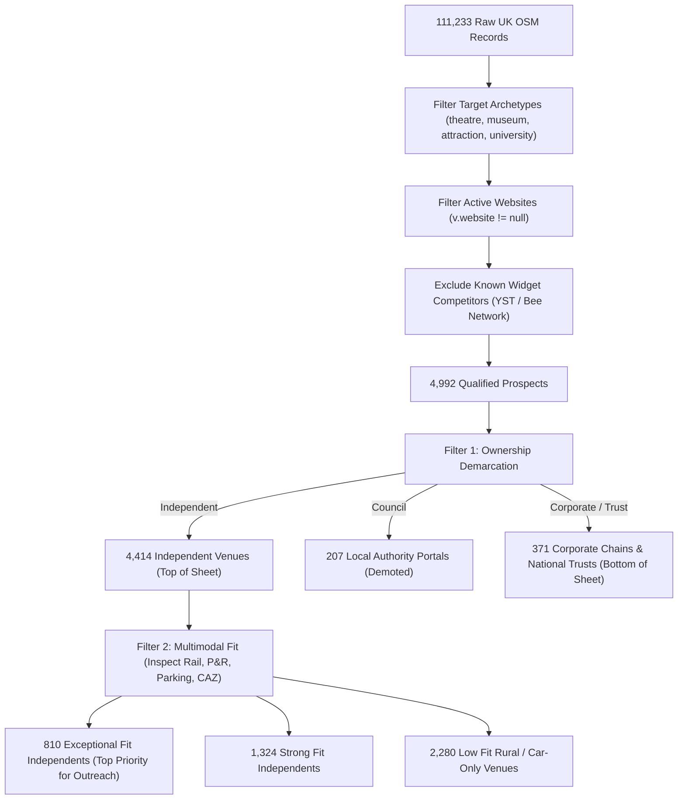

# EndMile Venue Travel Widget: Master Outbound Sales Playbook & Prospecting Engine

*Single source of truth for B2B venue outreach, competitor intelligence, and unserved prospect discovery.*
*Last updated: 2026-09-25*

---

## 1. Strategic Context & Competitor Ground Truth

### 1.1 The Market Dichotomy: Enterprise Procurement vs. The Unserved Mid-Market

The UK venue travel planning market is sharply divided into two extremes:

1. **Enterprise Procurement (You. Smart. Thing. / YST territory):**
   - **Target Clients:** Combined Transport Authorities (TfGM / Bee Network), Premier League / Tier 1 Stadiums (Co-op Live, CBS Arena, Headingley, Emirates Old Trafford), and Mega-Events (Wimbledon / AELTC, Glasgow Summer Sessions).
   - **Cost Structure (Crown Commercial Service G-Cloud 14 Rate Card):**
     - Day rate: **£750 / day** (exclusive of VAT).
     - Single-location onboarding: **~3 days minimum (£2,250 setup fee)**.
     - Multi-location onboarding: **~15 days (£11,250 setup fee)**.
     - Bespoke ticketing/CRM integration: **£750 / day**.
     - Messaging fees: **£0.10 per SMS**.
     - Annual platform licence: Bespoke 5-figure enterprise contract.
   - **Technical Stack:** Embedded iframe (`<iframe src="https://travel.yousmartthing.com/bee_network">`) loading OpenTripPlanner (OTP), MapTiler vector tiles, UserWay accessibility overlay, and private Matomo telemetry.
   - **The Reality:** An independent regional theatre or civic museum cannot justify £2,250 upfront setup fees plus enterprise annual retainers for travel directions.

2. **The Non-Paying / Ticketing Platform Cohort ("TicketSource Users"):**
   - Venues like Red Ladder Theatre Company or St. John's Parish Hall linking to `travel.yousmartthing.com` are **not paying clients**.
   - TicketSource built an automated integration placing a generic travel assistant link into event confirmation emails.
   - These micro-venues have zero software budget and will not purchase a standalone SaaS widget.

3. **"Ghost" Slugs (Transit Trials & Municipal Projects):**
   - Slugs like `36-leeds-harrogate-ripley`, `1-lincoln-grantham`, and `17-blackpool-lytham` are **not venues**—they are transit corridor trials mapping bus routes (e.g. Transdev Route 36).
   - Slugs like `147_Nightclub`, `AfriLicken_Junction`, and `2-Tone_Village` were generated during a one-off 2021 Coventry City of Culture municipal grant; almost all are dormant.

4. **The Competitor Flaw (The Iframe Trap):**
   - Prominent cultural institutions (including the **Ashmolean Museum** at `ashmolean.org/directions` and **Pitt Rivers Museum** at `prm.ox.ac.uk/visit-us`) partnered with YST, but gave up embedding their heavy (~10MB, 600px rigid desktop height) iframe.
   - Because the iframe broke their mobile website layouts and caused double scrollbars, they downgraded to a plain text outbound link (`travel.yousmartthing.com`), bouncing visitors off their website.

### 1.2 The EndMile Strategic Wedge: Zero Competition with YST

> **Core Operating Rule:** We do NOT compete with You. Smart. Thing. for five-figure public transport authority or mega-stadium tenders. We leave TfGM and Co-op Live to them.

Instead, EndMile attacks the massive, neglected middle market: **the 4,992 UK cultural and visitor destinations that have NO travel widget installed at all.**

- **Setup Fee:** **£0** (vs. YST's £2,250+).
- **Implementation:** **1 line of HTML script/iframe** (under 2 minutes).
- **Price Point:** **£19 to £49 / month** self-serve on credit card (no committee tenders, no G-Cloud procurement).
- **Mobile-First UX:** Lightweight, 100% fluid responsive embed (no double-scrollbars, zero layout shift).
- **Unique Capabilities:** Door-to-door multimodal routing (driving + parking vs rail + walk), real-time parking tariffs, Clean Air Zone (CAZ) alerts, and one-click Julie's Bicycle Scope 3 carbon reporting for Arts Council England (ACE) National Portfolio Organisations.

### 1.3 Traffic & Usage Modeling: How Many Visitors Use a Venue Widget?

Venues and competitors do not expose public search counters. Telemetry is sent to private endpoints. However, travel intent search volume can be accurately predicted using this footfall-to-search mathematical model:

$$\text{Monthly Web Sessions} \approx \frac{\text{Annual Footfall} \times 2.5}{12}$$

$$\text{Arrival Page Views} \approx \text{Monthly Web Sessions} \times 12\%$$

$$\text{Monthly Widget Searches} \approx \text{Arrival Page Views} \times 8\%\text{ to }12\%$$

#### Benchmarks & Pricing Fit:
| Venue Size / Footfall | Monthly Web Sessions | "Getting Here" Pageviews | Est. Monthly Widget Searches | Recommended EndMile Tier |
|---|---|---|---|---|
| **Small / Boutique** (30k–80k visits/yr)<br>*e.g. Civic Art Gallery, 400-seat theatre* | 6,250 – 16,600 | 750 – 2,000 | **60 – 240** | **Standard (£19/mo)** |
| **Mid-Sized Cultural** (100k–350k visits/yr)<br>*e.g. The Herbert, Regional Repertory Theatre* | 20,800 – 72,900 | 2,500 – 8,750 | **200 – 1,050** | **Standard (£19/mo) / Growth (£49/mo)** |
| **Large Cultural / Attraction** (400k–1M+ visits/yr)<br>*e.g. Ashmolean, Eureka!, Major Heritage Site* | 83,000 – 208,000 | 10,000 – 25,000 | **800 – 3,000** | **Growth (£49/mo) / Scale (£119/mo)** |

---

## 2. The 4 Target Venue Archetypes

### Archetype 1: Independent Regional Theatres & Arts Centres (300 to 2,000 seats)

- **Target Universe:** 954 qualified UK venues in OSM dataset with active websites.
- **Examples:** Leeds Grand Theatre, Harrogate Theatre, York Theatre Royal, Sheffield Crucible, Nottingham Playhouse, Chichester Festival Theatre, Belgrade Theatre Coventry, His Majesty's Theatre Aberdeen.
- **Operational Reality:**
  - Strict arrival window: 80% of attendees arrive in a compressed 45-minute window (6:45 PM – 7:30 PM).
  - High friction around evening city centre parking: confusing multi-storey tariffs, evening event flat rates, Clean Air Zone (CAZ) charges.
- **The Front-Line Commercial & Operational Pain:**
  - **Lost Secondary Spend**: When audience members get stuck in last-mile traffic or circle for city centre parking, they arrive flustered at the 2-minute call. They rush straight into the auditorium, completely skipping the bar, programmes, merchandise, and concessions—which is where regional venues make their highest profit margins (ticket revenue largely flows to touring producers and artists).
  - **Late-Curtain Disruptions**: Patrons delayed by city parking hunts arrive 10 minutes into the performance, forcing front-of-house to enforce auditorium holds or disrupt Act 1 with late seating in the dark.
  - **Website Bounce**: Static directions or Google Maps links bounce ticket holders off the venue's site to third-party apps that don't know the venue's entrance gates, local road closures, or preferred parking.
- **The Governance & Grant Pain:**
  - Arts Council England (ACE) National Portfolio Organisations (NPOs) and Theatre Green Book participants must track and report Audience Travel Scope 3 Carbon to **Julie's Bicycle**. Audience travel represents **>80% of the venue's total carbon footprint**, yet venues currently guess this through clumsy post-show email surveys with 3–4% response rates.
- **Target Personas / Job Titles:**
  - *Executive Director / Chief Executive*
  - *Head of Visitor Experience / Operations Director*
  - *Commercial Director / Front of House Manager*
  - *Sustainability / Environmental Lead*
- **EndMile Value Hook:**
  - Increases pre-show dwell time and protects high-margin bar/concession spend by helping audiences plan travel and arrive 30–45 minutes earlier.
  - Door-to-door transit and parking certainty eliminates late-curtain arrivals and seating holds.
  - 1-line script keeps visitors on-site instead of bouncing them to external apps.
  - Automated Julie's Bicycle Scope 3 audience travel carbon data export directly from real visitor journey telemetry.
- **Recommended Tier:** Standard (£19/mo) or Growth (£49/mo).

---

### Archetype 2: Regional Civic & University Museums & Art Galleries

- **Target Universe:** 2,418 qualified UK venues in OSM dataset with active websites.
- **Examples:** Bar Convent Museum York, Bowes Museum Barnard Castle, Kelvingrove Art Gallery Glasgow, National Museum of the Royal Navy Portsmouth, Royal Armouries Leeds, Fitzwilliam Museum Cambridge, Compton Verney.
- **Sub-Types:**
  1. *Urban / City Centre Museums & Galleries (e.g. Leeds, Oxford, Manchester, London, Bristol, Bath)*
  2. *Rural Heritage Estates, Historic Mansions & Country Parks (e.g. Compton Verney, Bowes Museum)*
- **The Front-Line Operational & Regulatory Pain:**
  - **Urban Pains:** Drivers face surprise £8–£12.50 daily Clean Air Zone (CAZ/ULEZ) charges or £20+ city centre multi-storey parking fees. Venues need to direct motorists toward suburban Park & Ride hubs or direct rail corridors before they enter congested city rings.
  - **Accessibility & Equality Act 2010 Pains:** 14.1M disabled individuals in the UK; elderly visitors, wheelchair users, and school trips need guaranteed step-free transit routes, verified walking distances from station exits, and Blue Badge bay locations upfront to eliminate booking hesitation.
  - **Rural / Estate Pains:** Rural heritage properties miss out on non-driving tourists and students who assume the estate is inaccessible without a car. Connecting mainline railway stations with local connecting buses and fixed-rate station taxis expands the visitor catchment pool. On peak bank holidays, single-track country lanes become choked with visitor traffic.
- **Target Personas / Job Titles:**
  - *Head of Visitor Services / Visitor Experience Manager*
  - *Operations Manager / Commercial Director*
  - *Access & Inclusion Officer / Sustainability Lead*
- **EndMile Value Hook:**
  - Alerts visiting motorists to Clean Air Zones and routes them to suburban Park & Ride hubs with live tariff transparency.
  - Built-in step-free transit routes and Blue Badge parking locations for Equality Act compliance.
  - Bridges the rural transit gap by linking rail with local bus/taxi connections, expanding car-free visitor footfall.
- **Recommended Tier:** Standard (£19/mo) or Growth (£49/mo).

---

### Archetype 3: Regional Visitor Attractions, Heritage Sites & Wildlife Parks

- **Target Universe:** 1,197 qualified UK venues in OSM dataset with active websites.
- **Examples:** Yorkshire Wildlife Park, Black Country Living Museum, Beamish Museum, Prior Park Bath, Twycross Zoo, Banham Zoo.
- **Sub-Types:**
  1. *Family Zoos, Safari Parks & Commercial Attractions*
  2. *Greenfield Outdoor Attractions, Farm Parks & Heritage Railways*
- **The Front-Line Operational & Commercial Pain:**
  - **10:00 AM Morning Ingress Bottlenecks:** Unlike evening theatres, family attractions experience extreme morning arrival spikes (10:00–11:30 AM). Queuing traffic backs up onto arterial A-roads, triggering police warnings and local authority highway enforcement notices.
  - **Family Motoring Cost Uncertainty:** For visiting families, petrol plus on-site parking (£15–£20) is a major expense. Lack of door-to-door transit cost transparency causes drop-off during the advance ticket checkout flow.
  - **Temporary Traffic Regulation Orders (TTROs) & Seasonal Events:** Major outdoor events require strict adherence to council temporary traffic routes and designated event overflow car parks; generic navigation apps steer drivers into closed lanes or residential streets.
- **Target Personas / Job Titles:**
  - *Director of Operations / General Manager*
  - *Visitor Operations Manager / Head of Commercial Operations*
  - *Event Logistics Coordinator / Marketing Director*
- **EndMile Value Hook:**
  - Steers visiting families to designated approach corridors, Park & Ride, and overflow car parks before they hit the access road, flattening morning arrival peaks.
  - Displays upfront motoring costs (fuel + parking) alongside family train fares to give booking confidence.
  - Locks approved council TTRO routes and specific event entrance gate pins directly into the visit page embed.
- **Recommended Tier:** Growth (£49/mo) or Scale (£119/mo).

---

### Archetype 4: Universities & Higher Education Campuses (Open Days & Visitor Centers)

- **Target Universe:** 423 qualified UK institutions in OSM dataset with active websites.
- **Examples:** University of Leeds, University of Manchester, Bristol, Derby, Solent, Royal Central School of Speech and Drama.
- **Sub-Types:**
  1. *Undergraduate Open Days & Graduation Ceremonies*
  2. *Campus Masterplans & Section 106 Sustainable Travel Plans*
- **The Front-Line Operational & Regulatory Pain:**
  - **Saturday Parent Ingress Chaos:** 5,000 to 15,000 parents and prospective students arrive within a 2-hour Saturday morning window. Barrier car parks fill by 9:15 AM, creating gridlock across city ring roads and ruining the student recruitment experience.
  - **Multi-Site Campus Wayfinding:** Mainline rail journeys drop visitors at the city centre station with zero clarity on how to reach specific faculties, satellite campuses, or halls of residence.
  - **Section 106 Planning Compliance:** Universities expanding campus facilities must legally demonstrate verified reductions in single-occupancy vehicle commutes under local planning authority agreements.
- **Target Personas / Job Titles:**
  - *Head of Student Recruitment / Events & Conferencing*
  - *Campus Travel & Sustainable Transport Manager*
  - *Director of Estates / Facilities Operations*
- **EndMile Value Hook:**
  - Embeddable Open Day Travel Planner guiding parents directly to satellite Park & Ride hubs, park-and-walk zones, and direct rail connections.
  - Door-to-door routing terminating at specific faculty entrance doors rather than generic city pins.
  - Continuous, verified modal split telemetry (active, rail, bus) to satisfy council Section 106 planning requirements without manual annual surveys.
- **Recommended Tier:** Scale (£119/mo).

---

## 3. Modular Cold Email Construction Kit

*Written strictly according to `.agents/skills/cold-email/SKILL.md`: peer-to-peer voice, under 120 words, lowercase 2-4 word subject lines, zero AI buzzwords, interest-based low-friction ask.*

### 3.1 Strict Writing Principles
1. **Lowercase, boring subject lines:** Must look like an internal email from a colleague (`visitor directions`, `getting here page`, `parking queries`, `curtain times`). No title case, no exclamation marks, no product names.
2. **Ruthlessly concise:** Cut any sentence that doesn't advance the reply. Target length: **65–110 words**.
3. **No vendor language:** Never say "I hope this email finds you well", "We are the leading provider", "synergy", "leverage", or "game-changer".
4. **Lead with their world:** Focus on their front-of-house phone volume, curtain holds, or car park confusion.
5. **Low-friction CTA:** Never ask for a 30-minute phone call. Ask if they want a 2-minute drop-in preview of how it looks for their specific venue.

---

### 3.2 Modular Email Construction Kit (Mix & Match by Sector)

Use this modular matrix to compose customized emails in seconds:

#### Slot 1: Subject Line Bank (Choose One)
- `visitor directions`
- `getting here page`
- `plan your visit`
- `{{venue_name}} directions`

#### Slot 2: The Observation Hook (Choose One by Archetype)
- **Theatre Hook:** `Looking at {{venue_name}}'s "Getting Here" page, visitors planning their trip currently have to read through static text paragraphs and jump between map apps and train timetables.`
- **Museum Hook:** `Taking a look at the visitor guide on {{venue_name}}'s website, day visitors currently have to sort through multiple text bullet points to compare driving vs public transit.`
- **Attraction Hook:** `Looking at the arrival advice on {{venue_name}}'s website, families planning a day out currently have to manually cross-reference driving routes, parking advice, and train connections across different tabs.`
- **Live Music Hook:** `For evening gigs finishing after 10:30 PM at {{venue_name}}, out-of-town attendees often struggle to check return train and bus times in advance.`

#### Slot 3: The Credibility / Solution Drop (Choose One)
- **Universal Flagship:** `We built EndMile as an interactive visit planner that embeds directly onto your website with zero technical setup. Visitors simply enter their home postcode and get live train times, walking routes, and official car parks side-by-side.`
- **The Rural Transit Angle:** `EndMile embeds directly onto your visit page with zero technical setup, showing door-to-door transit routes that link mainline rail arrivals with local onward travel.`
- **The Family Cost Angle:** `We built EndMile as an interactive visit planner that plugs directly into your website. Families simply enter their home postcode to instantly compare driving and parking costs side-by-side with rail and transit fares in one view.`
- **The Arts / Julie's Bicycle Angle (NPOs Only):** `EndMile embeds directly on your visit page, giving audience members live journey directions while passively logging verified travel modal splits and passenger mileage in the background.`

#### Slot 4: The Low-Friction Ask CTA (Referencing the Visual Mockup)
- `I went ahead and mocked up how this looks on your actual visit page (see attached screenshot). Would you be open to trying a live preview?`
- `I attached a quick mockup showing how it sits on your website. Would this be useful for {{venue_name}}?`
- `I mocked up how this looks on {{venue_name}}'s visit page (attached). Worth sending over a quick preview link to test?`

---

#### The Core Outbound Campaigns:
- **Campaign 1 (`VENUE_VISIT_A`):** Universal Flagship (All Cultural Venues) — Replacing Static Transport Bullet Points with Interactive Door-to-Door Planner.
- **Campaign 2 (`GIG_CURFEW_A`):** Music Venues & Concert Halls — Post-Gig Public Transit & Last Train Timing.
- **Campaign 3 (`MUSEUM_PLANNER_A`):** Urban Museums & Galleries — Transit vs Driving Clarity & Live Parking.
- **Campaign 4 (`HERITAGE_RURAL_B`):** Rural Heritage & Historic Estates — Connecting Mainline Rail to Rural Heritage & Local Shuttles.
- **Campaign 5 (`ATTRACT_FAMILY_A`):** Family Attractions & Zoos — Driving & Parking Costs vs Family Rail Fares Price Transparency.
- **Campaign 6 (`THEATRE_SCOPE3_A`):** Arts Council England (ACE) NPOs — Replacing Low-Response Survey Guesswork with Passive Scope 3 Telemetry.
- **Universal Gatekeeper (`VENUE_INFO_REFERRAL`):** Reception / Info Desks — Disarming Founder Ask for Website or Visitor Ops Lead.
- **Dormant Draft (`THEATRE_ACCESS_B`):** Accessibility & Step-Free Transit — Held in reserve pending algorithm verification.

---

### 3.4 The Visual Proof Multiplier: DevTools Mock Screenshot Outbound

Venue directors, operations heads, and visitor experience managers receive dozens of generic sales emails a week. Abstract pitches ("imagine an embeddable widget") or plain URLs are routinely ignored.

**The Solution:** Using Playwright headless Chromium (`scripts/outreach/generate_venue_mock_screenshot.py`), EndMile automatically:
1. Navigates to the prospect's real website and discovers their dedicated "Getting Here", "Your Visit", or "Directions" page.
2. Dismisses cookie banners and modals.
3. Injects the EndMile Journey Planner card (`#endmile-mock-widget`) directly into their page's DOM (above their static map or under their primary visit H1 header).
4. Captures a crisp 1.5x retina screenshot (`screenshots/venues/{VenueID}_{Slug}.png`) displaying their own logo, branding, and navigation alongside the embedded EndMile widget.
5. Attaches the image directly to the cold email via `--attach-screenshot` and adjusts the closing CTA to reference the visual proof.

**Impact on Prospect Psychology:**
- Instantly proves the email is genuinely bespoke and that the founder personally reviewed their website.
- Eliminates any ambiguity about what the widget is, how it looks, or where it lives.
- Reduces friction to zero: the prospect can judge the visual aesthetic right inside their email client on mobile or desktop without clicking external links.

```bash
# Generate mock screenshot for any venue:
python scripts/outreach/generate_venue_mock_screenshot.py --url https://www.oxfordplayhouse.com --name "Oxford Playhouse" --archetype theatre

# Dispatch outreach batch with screenshot attachments:
python scripts/outreach/send_venue_outreach.py --limit 5 --variant auto --attach-screenshot
```

- **Cohort 1A: Independent Regional Playhouses & Commercial Theatres**
  - **Variant A (`THEATRE_JOURNEY_A` — Digital Retention vs Google Maps):** Focuses on stopping ticket buyers from bouncing to external map apps that lack entrance context and local parking.
  - **Variant B (`THEATRE_ACCESS_B` — Step-Free Confidence):** Focuses on accessibility, step-free rail transit, and Blue Badge parking certainty to eliminate booking hesitation.
- **Cohort 1B: Music Venues, Gig Spaces & Concert Halls**
  - **Variant A (`GIG_EGRESS_A` — Late-Night Transit Curfews):** Flags last regional train/tram departures so fans don't get stranded post-23:00.
  - **Variant B (`GIG_DISPERSAL_B` — Post-Curfew Dispersal & Licensing):** Directs fans to arterial transit corridors to satisfy council premises licensing conditions.
- **Cohort 1C: Arts Council England NPOs & Green Book Venues**
  - **Variant A (`THEATRE_SCOPE3_A` — Julie's Bicycle Scope 3 Automation):** Solves the annual audit burden (>80% of footprint) by replacing 3-4% post-show survey guesswork with verified telemetry.
  - **Variant B (`THEATRE_GREENBOOK_B` — Green Book Operations Standard):** Demonstrates active modal shift tracking to meet Green Book operations standards.

---

#### Campaign 2: Regional Civic & University Museums & Art Galleries

- **Cohort 2A: Urban / City Centre Museums (In or Near Clean Air Zones)**
  - **Variant A (`MUSEUM_CAZ_A` — Clean Air Zone & Parking Penalties):** Alerts visiting motorists to £12.50 CAZ charges and steers them to suburban Park & Ride hubs with live tariff comparisons.
  - **Variant B (`MUSEUM_ACCESS_B` — Equality Act Step-Free Access):** Provides step-free walking paths from station exits and Blue Badge locations for disabled, senior, and school group visitors.
- **Cohort 2B: Rural Heritage, Castles, Gardens & Historic Houses**
  - **Variant A (`HERITAGE_CATCHMENT_A` — Non-Driver Catchment Expansion):** Connects mainline rail with connecting local buses and fixed-fare taxis, unlocking the non-driving tourist and student market.
  - **Variant B (`HERITAGE_LANES_B` — Rural Country Lane Bottlenecks):** Steers visiting drivers along approved highway corridors away from single-track country lanes and residential verges.

---

#### Campaign 3: Regional Visitor Attractions, Zoos & Wildlife Parks

- **Cohort 3A: Major Family Attractions, Zoos & Wildlife Parks**
  - **Variant A (`ATTRACT_INGRESS_A` — 10am Morning Ingress Tailbacks):** Manages the 10:00–11:30 AM arrival spike, preventing tailbacks onto arterial A-roads and police warnings.
  - **Variant B (`ATTRACT_COST_B` — Family Motoring vs Rail Cost Transparency):** Compares petrol + on-site parking fees (£15–£20) against family train fares upfront to stop ticket booking abandonment.
- **Cohort 3B: Greenfield & Outdoor Seasonal Attractions**
  - **Variant A (`ATTRACT_HIGHWAY_A` — Council TTRO Compliance):** Complies with council Temporary Traffic Regulation Orders and designated temporary event gates.
  - **Variant B (`ATTRACT_GREEN_B` — Green Visitor Scheme Tracking):** Validates car-free arrivals and tracks uptake for Good Journey / Green Tourism admission discount schemes.

---

#### Campaign 4: Higher Education Campuses & Open Days

- **Cohort 4A: Undergraduate Open Days & Graduations**
  - **Variant A (`UNI_OPENDAY_A` — Saturday Parent Ingress Gridlock):** Guides 5,000–15,000 driving parents directly to designated satellite Park & Walk lots before campus barrier car parks fill at 9:15 AM.
  - **Variant B (`UNI_CAMPUS_B` — Station-to-Faculty Building Navigation):** Routes prospective students and parents from the mainline train station right to specific faculty entrance halls.
- **Cohort 4B: Sustainable Travel Plans & Planning Permission**
  - **Variant A (`UNI_TRAVELPLAN_A` — Section 106 Modal Split Compliance):** Continuous, verified travel search telemetry across active travel, rail, and bus to prove modal shift for local planning authorities without manual annual surveys.

---

#### Universal Outreach Flow (All Archetypes)

- **Touch 1 (Day 1):** Sniper pitch using Variant A or B tailored to the venue archetype.
- **Touch 2 (Day 4):** Alternate angle follow-up (e.g. accessibility, modal shift, or seasonal timing).
- **Touch 3 (Day 7):** Interactive Mockup Preview (`VENUE_FOLLOWUP_PREVIEW`) delivering their dynamic URL (`https://endmilerouting.co.uk/venue-widget/?url=...&venue=...`).
- **Touch 4 (Day 11):** Polite Breakup closing the loop.

---

#### Campaign 4: University Campuses (e.g. Derby, Solent, Royal Central)

**Touch 1 (Day 1) — Open Day Campus Travel & Local Congestion**
```text
Subject: open day directions

Hi {{FirstName}},

Looked at the campus travel guide on {{domain}} ahead of upcoming visitor days.

On open days, directing thousands of visiting families to the right campus car parks without snarling local roads is always a headache for security and events teams.

We built a lightweight travel hub widget that embeds directly on open day landing pages. It compares door-to-door driving costs and parking against rail timetables, routing drivers to designated Park & Ride lots rather than gridlocked campus gates.

Worth sending a 2-minute preview for {{venue_name}}?

Best,
Isaac
EndMile
```

**Touch 2 (Day 4) — Campus Modal Split Targets**
```text
Subject: modal split data: {{venue_name}}

Hi {{FirstName}},

Following up briefly—the widget also logs visitor origin postcodes and travel mode splits, providing concrete data for university sustainable travel and Scope 3 transport reporting.

Would a 2-minute preview for the {{venue_name}} campus be of interest?

Best,
Isaac
```

**Touch 3 (Day 9) — Polite Breakup**
```text
Subject: open day directions

Hi {{FirstName}},

Assuming campus event travel is completely sorted for now.

I'll close the loop here, but feel free to get in touch if you'd ever like to see how the open day travel hub works.

Best,
Isaac
```

---

## 4. Objection Handling & Pushback Playbook

When prospects reply, use these concise, peer-level responses:

### Objection 1: "We already have a Google Maps link on our website."
> *"Google Maps is great for turn-by-turn driving once you're in the car, but it doesn't show visitors local parking tariffs, compare rail vs driving costs, or keep visitors on your website. Our widget embeds directly into your 'Getting Here' page so visitors get full door-to-door transit, parking costs, and walking times in one place without bouncing away."*

### Objection 2: "We don't have web developers or IT budget to build this."
> *"There's zero development needed. It's a single line of HTML snippet that you or your web manager can paste into WordPress, Drupal, or Squarespace in two minutes. We host and maintain the routing, parking data, and live transit feeds."*

### Objection 3: "We have no budget / budgets are frozen."
> *"Completely understand. Our Standard plan is just £19/month on a monthly credit card with zero setup fee and no annual contract. Selling just 3 to 4 extra pre-show drinks or interval ice creams a month pays for the entire £19/mo subscription—by getting just a handful of ticket holders through the doors 30 minutes earlier rather than rushing in flustered at the 2-minute bell. We also offer a 14-day free pilot so you can test it on a live production first."*

### Objection 4: "Why wouldn't we just use You. Smart. Thing.?"
> *"YST is great for £20k enterprise transport authority tenders like TfGM Bee Network or mega-stadiums, but they charge £2,250 minimum setup fees and day rates for single locations. EndMile is purpose-built for independent cultural venues: £0 setup, self-serve from £19/month, lightweight mobile-first UX, and automated Julie's Bicycle carbon exports."*

### Objection 5: "Is there a long-term contract?"
> *"No long-term contract. It's a simple month-to-month subscription that you can cancel anytime with one click in your portal."*

---

## 5. Prospect Discovery Engine & Qualification Architecture

### 5.1 The Two Critical Outreach Quality Filters (2026-09-26 Upgrade)

Raw OpenStreetMap data contains over 111,000 UK venues, but prospecting requires two essential qualification filters to ensure your outreach converts:

#### Filter 1: Ownership Demarcation (Independent vs. Corporate Chains & Council Portals)
- **The Issue:**
  1. **Corporate Entertainment Chains & National Trusts:** Venues owned by Ambassador Theatre Group (`atgtickets.com`), Live Nation / Academy Music Group (`academymusicgroup.com`), Merlin Entertainments (`thedungeons.com`, `visitsealife.com`, `madametussauds.com`, `londoneye.com`, `altontowers.com`, `warwick-castle.com`, `cadburyworld.co.uk`), National Trust (`nationaltrust.org.uk`), National Trust for Scotland (`nts.org.uk`), or Royal Collection Trust (`rct.uk`) have zero local web authority. IT, digital marketing, and CMS code are strictly governed from centralized corporate headquarters (e.g. Merlin in Poole, National Trust in Swindon, ATG in London).
  2. **Local Authority / Council Portals:** Civic landmarks like The Roman Baths (`romanbaths.co.uk` / B&NES Council), Scott Monument (`edinburghmuseums.org.uk` / City of Edinburgh Council), and M Shed (`bristolmuseums.org.uk` / Bristol City Council) operate under municipal committee procurement where adding third-party SaaS tools requires lengthy council tenders.
- **The Solution:** The discovery engine automatically segregates all 4,992 venues into 3 distinct ownership models:
  - **`Independent Single/Dual-Site` (4,414 venues):** Autonomous trusts, civic arts centres, and independent commercial operators with direct decision-making power. **These occupy the top 1,000+ rows of your spreadsheet.**
  - **`Local Authority / Council` (207 venues):** Municipal museums and council culture portals (demoted below independent venues).
  - **`Corporate Chain / Centralized Trust` (371 venues):** Multi-venue commercial operators, cinema chains, and national heritage trusts (pushed to the very bottom).

#### Filter 2: Multimodal Transit Fit vs. Rural Car-Only Sites (The "Yorkshire Sculpture Park" Problem)
- **The Issue:** If a venue is in a remote rural setting with no walkable railway station, no bus routes, no Park & Ride, and only a single on-site field car park (e.g. *Yorkshire Sculpture Park*, where Darton station is nearly 6 km away and requires a £12 taxi), an interactive multimodal journey widget delivers minimal value. Visitors have only one viable choice: drive. Pitching a multimodal tool to them gets ignored.
- **The Solution:** The discovery engine inspects our B2C routing data (`data/b2c/content/[venueId].json`) to evaluate the **Widget Value Score (0 to 100)**:
  - **Walkable Railway Station (within 20 mins):** +25 pts
  - **Clean Air Zone (CAZ) / ULEZ / Low Emission Zone:** +20 pts (high driver pain; avoiding emission fines)
  - **Park & Ride Hub:** +15 pts (high congestion; directing cars to P&R)
  - **Verified Parking Tariffs:** +10 pts (parking confusion & cost comparison)
  - **Independent Single/Dual-Site Operator:** +15 pts (empowered decision-maker)
  - **Capacity / Footfall (>500 seats or >100k annual visits):** +15 pts
- **The Fit Tiers:**
  - **Exceptional Fit (Score 60+):** **810 independent venues** (dense urban centers, walkable trains, CAZ fees, P&R hubs). *Pitch these first.*
  - **Strong Fit (Score 40–59):** **1,324 independent venues** (regional hubs with at least 1 strong multimodal alternative).
  - **Low Fit (Score <40):** **2,280 venues** (car-only rural parks, country estates). Deprioritized in the CSV.


```mermaid
flowchart TD
    A["111,233 Raw UK OSM Records"] --> B["Filter Target Archetypes (theatre, museum, attraction, university)"]
    B --> C["Filter Active Websites (v.website != null)"]
    C --> D["Exclude Known Widget Competitors (YST / Bee Network)"]
    D --> E["4,992 Qualified Prospects"]
    E --> F["Filter 1: Ownership Demarcation"]
    F -->|Independent| G["4,414 Independent Venues (Top of Sheet)"]
    F -->|Council| H["207 Local Authority Portals (Demoted)"]
    F -->|Corporate / Trust| I["371 Corporate Chains & National Trusts (Bottom of Sheet)"]
    G --> J["Filter 2: Multimodal Fit (Inspect Rail, P&R, Parking, CAZ)"]
    J --> K["810 Exceptional Fit Independents (Top Priority for Outreach)"]
    J --> L["1,324 Strong Fit Independents"]
    J --> M["2,280 Low Fit Rural / Car-Only Venues"]
```

---

### 5.2 Running the Discovery Pipeline

Run the tool from repository root in `../endmile-1`:
```bash
node scripts/scrapers/generate-unserved-prospects.mjs
```

Run test suite:
```bash
node scripts/scrapers/generate-unserved-prospects.test.mjs
```

Outputs generated:
- [`data/venues/unserved_prospects.csv`](file:///c:/Users/isaac/Videos/files%20too%20big%20for%20onedrive/github/endmile-1/data/venues/unserved_prospects.csv): Spreadsheet-ready CSV with 21 columns including `OwnershipType`, `WidgetFit`, `Column 1 (Notes & Contacts)`, `DeepLinkGoogleSearch`, `EndMileGuideUrl`, and `EmailHook`.
- `C:\Users\isaac\Downloads\endmile_widget_prospects.xlsx`: Native Excel Workbook formatted as an official **Excel Table (`ProspectTable`)** with instant column sort/filter dropdowns, frozen header row, and clickable deep-links.
- [`data/venues/unserved_prospects.json`](file:///c:/Users/isaac/Videos/files%20too%20big%20for%20onedrive/github/endmile-1/data/venues/unserved_prospects.json): Complete structured JSON database (4,992 records).

---

## 6. Curated High-ROI Independent Launch Targets

*Top independent UK venues with empowered local management, high multimodal arrival friction, and zero travel widget installed:*

### 6.1 Regional Independent Theatres & Arts Centres (Exceptional Fit)
| Venue Name | Location | Domain | Capacity | Fit Score & Multimodal Features | Tailored Email Hook Angle |
|---|---|---|---|---|---|
| **Charing Cross Theatre** | London | `charingcrosstheatre.co.uk` | 265 seats | **Score: 95** (Rail 2m walk; P&R; CAZ/ULEZ; Parking Tariffs) | Rail station 2-min walk vs London congestion & parking tariffs |
| **Oxford Playhouse** | Oxford | `oxfordplayhouse.com` | 630 seats | **Score: 95** (Rail 10m walk; 5 P&R hubs; Oxford ZEZ; Parking) | Oxford Zero Emission Zone (ZEZ) & 5 Park & Rides vs rail walk |
| **Tramway** | Glasgow | `tramway.org` | 500 seats | **Score: 95** (Rail 5m walk; P&R; Glasgow LEZ; Parking) | Pollokshields East station (5m) & Glasgow LEZ emission rules |
| **York Theatre Royal** | York | `yorktheatreroyal.co.uk` | 750 seats | **Score: 90** (Rail 8m walk; 6 P&R hubs; Parking; ACE NPO) | Julie's Bicycle Scope 3 reporting & York Park & Ride routing |
| **Harrogate Theatre** | Harrogate | `harrogatetheatre.co.uk` | 500 seats | **Score: 85** (Rail 4m walk; Parking Tariffs; High Capacity) | Harrogate station (4m walk) vs evening multi-storey parking charges |
| **Belgrade Theatre** | Coventry | `belgrade.co.uk` | 858 seats | **Score: 85** (Rail 12m walk; Parking Tariffs; High Capacity) | Coventry station walk vs city centre evening parking tariffs |
| **Sheffield Crucible / Lyceum** | Sheffield | `sheffieldtheatres.co.uk` | 980 seats | **Score: 90** (Rail 6m walk; Supertram; Sheffield CAZ) | Sheffield Clean Air Zone warnings & station footbridge link |
| **Bush Hall** | London | `bushhallmusic.co.uk` | 400 seats | **Score: 85** (Rail 7m walk; London ULEZ; Parking Tariffs) | Shepherd's Bush transit vs street parking restrictions |

### 6.2 Regional Civic & University Museums & Galleries (Exceptional Fit)
| Venue Name | Location | Domain | Est. Footfall | Fit Score & Multimodal Features | Tailored Email Hook Angle |
|---|---|---|---|---|---|
| **Sharmanka Kinetic Theatre & Gallery** | Glasgow | `sharmanka.com` | 60k | **Score: 95** (Rail 4m walk; P&R; Glasgow LEZ; Parking) | Argyle Street station (4m walk) & reception desk call deflection |
| **Royal Academy of Arts** | London | `royalacademy.org.uk` | 1.1M | **Score: 95** (Piccadilly Rail 16m; ULEZ; Parking; Transit) | Central London congestion charge & accessibility station walk |
| **Peckham Platform** | London | `peckhamplatform.com` | 50k | **Score: 95** (Rail 7m walk; London ULEZ; Parking Tariffs) | Peckham Rye station (7m walk) vs South London parking stress |
| **Bar Convent Museum** | York | `bar-convent.org.uk` | 80k | **Score: 90** (Rail 5m walk; 6 P&R hubs; Parking Tariffs) | 5-min walk from York station vs Micklegate parking fees |
| **Sir John Soane's Museum** | London | `soane.org` | 130k | **Score: 95** (Rail 17m walk; Holborn Tube; London ULEZ) | Public transit guidance & Holborn parking restrictions |
| **The Bowes Museum** | Barnard Castle | `thebowesmuseum.org.uk` | 120k | **Score: 80** (P&R; Verified Parking; Rural Transit Hub) | Coach drop-offs & designated car park guidance |
| **Royal Armouries Museum** | Leeds | `royalarmouries.org` | 450k | **Score: 85** (Rail 14m walk; Water Taxi; Clarence Dock Parking) | Clarence Dock parking fees vs Leeds station walk/water taxi |

### 6.3 Visitor Attractions & Heritage Destinations (Exceptional Fit)
| Venue Name | Location | Domain | Est. Footfall | Fit Score & Multimodal Features | Tailored Email Hook Angle |
|---|---|---|---|---|---|
| **SS Great Britain** | Bristol | `ssgreatbritain.org` | 320k | **Score: 90** (Bristol Ferry; Temple Meads bus; Bristol CAZ) | Bristol Clean Air Zone fees & ferry link vs harbour parking |
| **Jorvik DIG** | York | `digyork.com` | 140k | **Score: 90** (Rail 10m walk; 6 P&R hubs; Timed Tickets) | Protecting timed entry slots by routing visitors to Park & Ride |
| **Eureka! The National Children's Museum** | Halifax | `eureka.org.uk` | 300k | **Score: 90** (Direct Rail Station Footbridge; Parking) | Direct Halifax station footbridge arrival vs car park queues |
| **Black Country Living Museum** | Dudley | `bclm.com` | 350k | **Score: 85** (Metro tram link; Coach bays; Overflow parking) | Family arrival peaks & overflow car park smoothing |
| **The Clydeside Distillery** | Glasgow | `theclydeside.com` | 100k | **Score: 85** (Rail 10m walk; Glasgow LEZ; Parking Tariffs) | Exhibition Centre rail station (10m) & Glasgow Low Emission Zone |
| **The Real Mary King's Close** | Edinburgh | `realmarykingsclose.com` | 250k | **Score: 90** (Waverley Rail 5m walk; Edinburgh LEZ; High Footfall) | Waverley station 5-min walk vs Old Town parking restrictions |

---

## 7. Next Actions & Daily Outbound Workflow

1. **Open the Sortable Excel Workbook:**
   * Open `C:\Users\isaac\Downloads\endmile_widget_prospects.xlsx` in Microsoft Excel.
   * Native **Excel Table (`ProspectTable`)** is pre-configured with filter dropdown arrows on every single column header.
2. **Sort or Filter in 1 Click:**
   * Click the dropdown arrow on `OwnershipType` &rarr; Filter to `Independent Single/Dual-Site`.
   * Click the dropdown arrow on `WidgetFit` &rarr; Filter to `Exceptional Fit` (810 top targets).
   * Sort by `WidgetFitScore` descending.
3. **1-Click Deep-Linked Contact Search:**
   * In Column `S` (`DeepLinkGoogleSearch`), click the hyperlink to immediately open Google Search pre-populated with your search dork to find the Visitor Experience, Operations, or Front of House Manager.
4. **1-Click Live Widget Preview:**
   * In Column `T` (`EndMileGuideUrl`), click the hyperlink to inspect the live EndMile guide and test how the widget renders for that specific venue.
5. **Send Personalized Outreach:**
   * Copy the tailored opening line from Column `U` (`EmailHook`) directly into the Touch 1 cold email template.
   * Log responses or emails found directly in Column `Q` (`Column 1 (Notes & Contacts)`).
